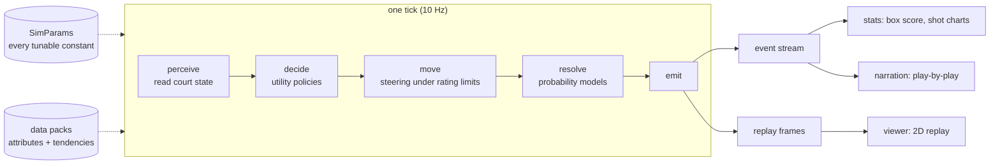

# hoopsh — Architecture

*A modular, deterministic, 2D-spatial basketball simulation core.*

> Everything here is designed so that **experiences** (MyPlayer careers,
> GM/franchise, historical what-ifs, broadcast viewing) are thin applications built
> around one engine — never entangled with it.

---

## 1. Design goals

1. **Ultra-realistic outputs.** Season-scale averages for a given ratings profile should
   land inside that player's real-life statistical range. League-wide aggregates (pace,
   efficiency, shot mix, rebounding, turnovers) must sit inside acceptance bands derived
   from real league data.
2. **Handcrafted identity.** Players are defined by human-editable **attributes**
   (what a player *can* do) and **tendencies** (what a player *wants* to do). No opaque
   learned blobs: every knob is inspectable, editable, shareable as a data pack.
3. **Modular and expandable.** Leagues are **rule packs** (NBA / NCAA / EuroLeague /
   custom). Rosters are **data packs**. Narration, stats, UIs, and future experiences are
   **consumers of the event stream** — the engine never knows they exist.
4. **Deterministic.** Same seed + same inputs ⇒ bit-identical game, every time, on every
   platform. Non-negotiable for debugging, calibration, and replay sharing.
5. **Fast.** Target ≥ 1 full game/second/core in Node. Calibration sweeps run thousands
   of games; speed is a feature.

## 2. The core bet: hybrid spatial–stochastic simulation

Pure physics sims are hard to calibrate; pure stat sims have no feel. hoopsh runs a
**continuous 2D spatial layer** (movement, spacing, defensive positioning) and resolves
**discrete events probabilistically** (shots, passes, fouls, rebounds) using models fed
by spatial context:

```
tick (10 Hz):
  1. perceive   — each agent reads court state (ball, matchups, openness, clock)
  2. decide     — utility-based policies pick actions (attributes + tendencies + tactics)
  3. move       — steering integration under speed/accel limits derived from ratings
  4. resolve    — scheduled discrete events fire through probability models
  5. emit       — events append to the game's event stream; frames append to the replay
```

The same pipeline as a picture. The two dotted inputs are the only tuning
surfaces (global constants in `SimParams`, per-player attributes and tendencies
in data packs); everything downstream hangs off two append-only outputs and
never reaches inside the loop:



The probability models take spatial inputs (shot distance, contest level, closing speed,
passing-lane geometry) and player ratings, and **every constant lives in `SimParams`** —
a single tunable parameter object. That is the calibration surface. Realism becomes a
measurable optimization problem: tune `SimParams` until league aggregates hit acceptance
bands, while archetype tests pin player differentiation.

Two layers of knobs, deliberately separated:

| Layer | Examples | Tuned by |
|---|---|---|
| Global (`SimParams`) | base make-prob per zone, foul rates, rebound geometry, decision temperatures | calibration harness, vs league data |
| Player (ratings → modifiers) | rating curves mapping 0–100 skills into model coefficients | archetype test suite |

A third layer — **era packs** — can later override global tendencies (1995 shot diet vs
2015 pace-and-space), which is exactly what "drop Jordan into 2015" needs.

## 3. Package layout (npm workspaces monorepo)

```
packages/
  engine/      pure, zero-dependency, deterministic sim core (Node + browser)
  stats/       event stream → box scores, advanced stats, shot charts
  data/        player/team JSON schemas, validation, sample fictional rosters
  narration/   template play-by-play + LLM color-commentary interfaces
  harness/     batch runner, acceptance bands, benchmarks, calibration tools,
               season/matchup driver, stats→ratings fitter (docs/SEASON.md,
               docs/ROSTERS.md)
  viewer/      single-file 2D canvas replay viewer (working prototype; frozen)
```

Dependency rule: `engine` imports nothing. Everything else imports `engine`.
Experiences (GM, MyPlayer, editor UI) will live outside these packages and speak to the
engine only through its public API: `simulateGame(config) → GameResult` (`{ seed, events, finalScore, frames, rules, params, teams }`; a `Replay` is assembled separately from that result via `buildReplay`).

## 4. Engine internals

### 4.1 Coordinates, units, time

- Units: **feet**, seconds. Court is `length × width` from the rule pack
  (NBA: 94 × 50). Origin at the home baseline's left corner; x along the court length.
- Hoops at `(rimInset, width/2)` and `(length − rimInset, width/2)`; NBA rim inset 5.25 ft.
- Tick rate `10 Hz` (a `SimParams` knob). A 48-minute game ≈ 28,800 ticks.

### 4.2 Rule packs

`RulePack` is data, not code: period count/length, OT length, shot clock (+ offensive
rebound reset), team-foul bonus thresholds, personal foul-out limit, three-point
geometry (arc radius, corner distance, corner break), court dimensions, clock-stopping
rules. NBA ships first. An NCAA pack exists and is selectable through the
harness `--league` flag (rule pack + bands + pace basis travel together);
its rule coverage is partial — unwired fields are labeled in
`rules/rulepack.ts` and registered in [docs/REGISTER.md](./docs/REGISTER.md).
EuroLeague is a follow-up. Custom leagues are just JSON.

### 4.3 Player model

- **Attributes (0–100):** physical (speed, accel, strength, vertical, lateral quickness,
  stamina, height/wingspan as real measurements) and skills (finishing, mid, three,
  free throw, ball-handle, pass accuracy/vision, perimeter/interior defense, steal,
  block, off/def rebounding, box-out, contest, decision speed, consistency).
- **Tendencies (0–100):** shot diet by zone, pull-up vs catch-and-shoot, drive/pass-out/
  iso/post frequencies, off-ball movement styles (spot-up, cut, screen), crash vs
  get-back, defensive gamble, foul aggression, tempo push.
- **Derived quantities:** ratings map to physical/model units through documented curves
  in `model/derived.ts` (e.g. speed 0–100 → max sprint ft/s). These curves are part of
  the calibration surface.

"Curry-ness" = elite three ratings + heavy three/pull-up tendencies + high off-ball
movement + gravity (defenses guard him tighter, farther out, which creates the
spacing his teammates feed on). Identity is a product of this interaction, not a script.

### 4.4 Offense AI

- Formation spots from a tactics template (5-out / 4-out-1-in chosen from personnel).
- Ball-handler policy scores `{shoot, drive, pass(x4), reposition}` each decision window:
  - Shot utility = predicted make prob (same model that resolves shots — the engine is
    self-consistent) × shot value + foul-draw EV, weighed against the possession's
    remaining continuation value, which decays as the shot clock drains. Late-clock
    heaves and early good-shot-taking emerge naturally.
  - Drive utility from lane openness; help convergence spikes kick-out utility —
    drive-and-kick emerges without scripting.
- Off-ball: hold/relocate to spacing spots, cut when lanes open, simple pick-and-roll
  action (screen delay on the on-ball defender; screener rolls or pops by tendency).

### 4.5 Defense AI

Man-to-man v1: positioning on the man–rim line, sag depth from shooter gravity and ball
distance (help side), closeouts on the catch, help rotation when a drive beats the
primary defender, contest quality from distance/closing speed/length at release.
Schemes (drop vs switch PnR coverage, zones) are later modules behind the same interface.

### 4.6 Rebounds, fouls, transition

- Miss location sampled by shot distance (long misses rebound long), then a weighted
  contest among boxout/positioning/athleticism of nearby players. Putbacks emerge.
- Foul models: shooting fouls (contest tightness, zone, defender aggression), reach-ins,
  charges (rare). Team-foul bonus and foul-outs from the rule pack. FT sequences.
- Live-ball turnovers and defensive rebounds trigger transition: if the defense isn't
  set, early-offense quality bonuses apply. Fast-break points emerge.
- Endgame management (timeouts, intentional fouling, hold-for-last, two-for-one,
  clock burn) is a layer that modulates the same EV framework rather than
  scripting plays (`GameConfig.endgame`). Default ON; `endgame: false`
  preserves the byte-identical legacy path. Its magnitude dials sit on the
  calibration sweep surface like any other `SimParams` constants; its
  window/threshold dials are design decisions, not calibration, and stay off it.
- Game-state coupling: the scoreboard feeds back into play all game, not just
  in the endgame windows. The trailing team's defense presses up and the
  leader's sags off — the same containment/closeout models that price every
  contest, leaned by the margin (concept 7 in the AI layer) — so margins
  mean-revert the way real ones do instead of diffusing without bound. The
  defensive channel is the one that ships: an offensive press/coast tilt is
  also wired, measured distribution-null, and stays at zero. Decided games
  additionally trigger a garbage-time concede rotation (`sim/subs.ts`): past
  a clock-scaled safe-lead line, both benches close the game out — leader
  first, with hysteresis so lineups never flip-flop — resting starters and
  stopping blowouts from growing to the horn. The concede requires the live
  coupling (uncoupled, bench-vs-bench endings measured margin-expanding).
  Magnitudes were fitted by measurement; the current measured state lives in
  [docs/CALIBRATION.md](./docs/CALIBRATION.md), open residuals in
  [docs/REGISTER.md](./docs/REGISTER.md).

### 4.7 Event stream & replay

Every discrete outcome is a typed event (`shot`, `pass`, `rebound`, `turnover`, `foul`,
`free_throw`, `substitution`, `violation`, period markers) carrying game clock, shot
clock, score, and spatial coordinates (shots carry x/y for shot charts). The replay file
= metadata + downsampled position frames + the event list; the viewer renders it without
re-simulating.

### 4.8 Determinism

One seeded PRNG (sfc32) owned by the game; no `Math.random`, no `Date.now`, no float
nondeterminism from iteration order. Tests assert bit-identical event streams for fixed
seeds.

## 5. Realism: how "Curry averages like Curry" actually gets enforced

1. **League acceptance bands** (harness): sim N games between balanced rosters; assert
   pace, points, FG%/3P%/FT%, 3PA rate, FTA rate, ORB%, TOV%, assists, steals, blocks,
   fouls all inside bands taken from real league seasons.
2. **Archetype tests** (engine test suite): hand-built extreme profiles must produce the
   right *shape* of stat line — the elite shooter's 3PA share, the rim-runner's points
   at the rim, the floor general's assist rate. Direction and band, not exact values.
3. **Star fixtures**: full ratings profiles for star archetypes simmed over seasons;
   assert the sim distribution overlaps the player's real-life season range (real
   players vary year to year — that variance defines honest tolerance).
4. **Parameter search**: `SimParams` is a flat, serializable object precisely so the
   harness can grid/random-search subsets of it against the acceptance report.

Calibration order matters: pace → shot mix → efficiency → fouls/rebounds/turnovers →
archetype differentiation. Each stage locks before the next tunes.

## 6. Narration layer

Consumes the event stream; never touches the engine.

1. **Template PBP** — every event rendered to text with variety pools, seeded selection,
   repeat-avoidance, and context trackers (scoring runs, lead changes, milestones,
   clutch time).
2. **`CommentaryProvider` interface** — receives windows of events + narrative context
   (storylines, box score snapshots, momentum) and returns color commentary. LLM-backed
   implementations plug in here; the template layer is the zero-cost fallback.
3. **Broadcast audio** (roadmap) — two-voice play-by-play + color scripts rendered to
   TTS for highlight reels and quarter recaps.

## 7. Performance budget

- ≥ 1 game/sec/core single-threaded in Node (bench harness tracks this from day one).
- Batch runner parallelizes across worker processes; determinism preserved per-game
  (each game owns its seed, so parallel order can't change results).
- If the budget ever breaks against a future feature: hot loops port to Rust/WASM behind
  the same TypeScript API. Nothing above the engine notices.

## 8. Roadmap

One roadmap, kept in [README.md](./README.md#roadmap). The live work
register — open items, with their measurements — is
[docs/REGISTER.md](./docs/REGISTER.md).
