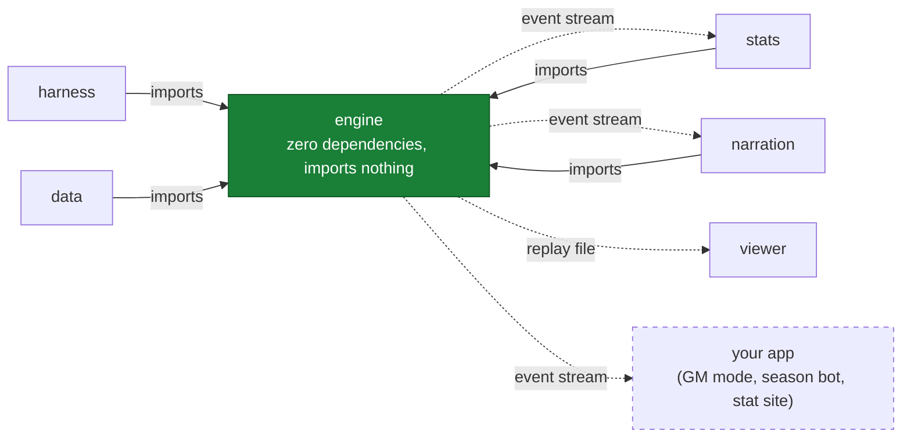

# hoopsh

*A modular, deterministic, 2D-spatial basketball simulation core.*

hoopsh simulates a basketball game as ten agents moving on a real court, ten times
per second — spacing, drives, kick-outs, cuts, closeouts, help rotations, box-outs.
Discrete outcomes (shots, passes, fouls, rebounds) resolve through probability
models fed by spatial context. The same seed produces the bit-identical game every
time, so a game is a file you can replay, diff, and share. Every point in a box
score traces back to a simulated shot at an (x, y) location. It is a 2D probability
model with position as an input, not a physics sim: there is no ball height, and
[docs/INTERNALS.md](./docs/INTERNALS.md) keeps the honest list of simplifications.

hoopsh is engine-first: MyPlayer careers, GM/franchise modes, historical what-ifs
("drop Jordan into 2015"), broadcast experiences — all of these are thin apps
consuming one core's event stream. Leagues (NBA, NCAA, EuroLeague) are swappable
**rule packs**; rosters are human-editable **data packs**.

## Quickstart — zero dependencies

All you need is **Node 24+**. No `npm install` — the repo runs directly from
TypeScript source via Node's native type stripping and a tiny loader hook.
The demo is one command:

```bash
git clone https://github.com/alperien/hoopsh && cd hoopsh
npm run sim                      # one game: box score + play-by-play + saved replay
```

Then:

```bash
npm run sim -- --seed my-seed    # deterministic: same seed = bit-identical game
npm run batch -- --games 50      # sim N games, grade vs NBA realism acceptance bands
npm run bench                    # games/sec benchmark (budget: ≥1; hardware-dependent, ~3-6 typical)
npm run test                     # full suite via node:test, zero installs (~2 min)
npm run broadcast                # two-voice broadcast script for a game

npm run roster:new               # scaffold your own team from archetypes (wizard);
                                 # writes out/new-team.team.json by default
npm run roster:validate -- out/new-team.team.json  # pack linting: fixes + plausibility warnings
npm run sim -- --home out/new-team.team.json       # ...and your team plays (docs/ROSTERS.md is the guide)

npm run season -- --teams 8      # deterministic round-robin season + standings (docs/SEASON.md)
npm run season -- --matchup 0,3 --sims 200   # Monte-Carlo one fixture: win prob + CI
```

A note on realism claims: the league-average checks the sim is tuned against
were written down from memory, not generated from sourced data (the play-by-play
references in `data/nba/` are the sourced part — 184 parsed real games). Making
every target citable is an active roadmap item, so this README quotes no pass
rates: run the checks yourself with `npm run batch`.

Optional dev tooling (`typescript`, `vitest`, `tsx`, `@types/node`) is
declared in `devDependencies` so one plain `npm install` reproduces the full
dev environment (`npm run typecheck`, `npm run test:vitest`) — but nothing at
runtime requires it; every command above works on a bare clone.
Note for readers of the test files: they import from `'vitest'`, which is NOT
installed — `tools/hooks.mjs` resolves that specifier to a `node:test`-backed
shim (`tools/shims/vitest.ts`), so `npm test` runs the whole suite with zero
dependencies. Installing real vitest simply takes over via `test:vitest`.

## Watch a game

```bash
npm run sim -- --seed showcase           # writes out/replay-showcase.json
npm run viewer:embed out/replay-showcase.json out/game.html
open out/game.html                       # macOS; Linux: xdg-open, Windows: start
```

Or open `packages/viewer/index.html` directly and **drag any replay JSON onto it**.
Playback controls: space to play/pause, ←/→ to skip ±10s, speed cycling, name labels,
made/missed shot splashes.

## Run a franchise

The GM game: thirty fictional teams, a full CBA (cap, tax, aprons, Bird
rights, rookie scale), AI front offices, a draft with scouting fog of war,
development and injuries, a news desk, and every game of every season
simulated by the engine above, possession by possession.

```bash
npm run gm                       # serves http://localhost:4200; pick a team in the browser
npm run gm -- --load my-league   # boot straight into a save
npm run gm:acceptance -- --seasons 5   # the multi-season league-health report
```

### Or live one career instead

The same app has a second chair: create a seventeen-year-old and climb.
A high-school senior season played possession by possession under prep
rules, recruiting boards that watch your actual box scores, the fork to
college, the EuroLeague, or the NBL, the combine, and a draft night run
by the same AI front offices that run the GM game. After that it is the
real league from the player's side of the desk: a pre-game approach
card projected onto your true tendencies, a coach whose plan you play
inside or against, a phone that only rings when the world has something
real to say, and a role that answers sustained production within six
games, always. Careers are a pure function of `(seed, choice log)`.

```bash
npm run gm                                      # choose "Live a career" on first run
npm run gm:career-acceptance -- --careers 3     # whole scripted careers, judged: gates and bands
```

Advance day by day (the `a` key), set the rotation, work the trade desk,
watch your games as a two-voice broadcast ticker or in the 2D viewer.
Saves are plain JSON under `out/saves/`; a league is a pure function of
(seed, your action log). The design document is
[docs/FRANCHISE.md](./docs/FRANCHISE.md); the module map is
[docs/FRANCHISE_INTERNALS.md](./docs/FRANCHISE_INTERNALS.md).

The viewer needs a browser — there is no terminal renderer. On a headless box
(SSH, CI, an agent sandbox) the game is still readable as text: every
`npm run sim` writes the full play-by-play to `out/pbp-<seed>.txt`, and
`npm run broadcast` renders a two-voice announcer script.

## How it fits together

| Package | What it does |
|---|---|
| `@hoopsh/engine` | Pure, zero-dependency, deterministic sim core (Node + browser) |
| `@hoopsh/stats` | Event stream → box scores, exact minutes/±, advanced stats, shot charts |
| `@hoopsh/data` | Player/team schemas, validation, archetype builders, sample teams |
| `@hoopsh/narration` | Template play-by-play with run/milestone awareness + LLM commentary interfaces |
| `@hoopsh/harness` | Batch runner, NBA acceptance bands, benchmarks, calibration tooling |
| `@hoopsh/franchise` | Deterministic GM/franchise league layer: calendar, CBA, AI front offices, development, injuries, news, history (docs/FRANCHISE.md) |
| `@hoopsh/career` | Deterministic career mode: one created player from the high-school gym to the league and out the far end (docs/CAREER.md) |
| `@hoopsh/app` | The GM game app: local web server, worker-pool game execution, saves, and the browser UI |
| `packages/viewer` | Single-file 2D canvas replay viewer (embed tool + drag-and-drop) |

One rule holds the design together: **`engine` imports nothing; everything else
consumes what it emits.**



Solid arrows are compile-time imports: they all point INTO the engine, which
imports nothing — no npm packages, no `node:` built-ins. Dashed arrows are runtime
data flowing OUT: the typed event stream (`core/events.ts`, the public contract)
and the replay file, which the viewer renders without re-simulating. The engine
never learns who consumes it; a change that makes it aware of a consumer breaks
the arrows, and that is the review test. Full design rationale in
[ARCHITECTURE.md](./ARCHITECTURE.md).

## Build on it

The engine is a library. `simulateGame(config)` returns `{ seed, events,
finalScore, frames, rules, params, teams }`, and the event stream is the same
surface this repo's own box scores, narration, and viewer are built on — a
consumer you write sits at exactly that distance. Natural fits: season bots,
custom stat sites, alternative viewers, GM/career layers, LLM color commentary
(the `CommentaryProvider` seam). The builder's guide is
[docs/EMBEDDING.md](./docs/EMBEDDING.md): loader recipe, `GameConfig`, the
supported API surface, worked examples. The stability contract is
[docs/CONTRACT.md](./docs/CONTRACT.md): the stable surfaces, the explicitly
unstable ones, and what a version bump means.

Input contract: `simulateGame` always rejects non-finite ratings loudly; pass
`validate: 'strict'` to also enforce the data-pack ranges (ratings 0-100) when
rosters come from untrusted sources — the default tier deliberately admits
out-of-range finite values for custom content and stress tests.

## The core bet: hybrid spatial–stochastic simulation

Pure physics sims are hard to calibrate; pure stat sims have no feel. hoopsh runs
continuous 2D movement and decision-making, but resolves discrete events through
logistic models whose every constant lives in one flat object: **`SimParams`**, the
calibration surface. Player identity comes from handcrafted **attributes** (what a
player *can* do) and **tendencies** (what they *want* to do). An elite shooter profile
produces a heavy deep-three diet, off-ball gravity that warps the defense, and
star-level scoring volume as a result of these interactions, without being scripted.

Signature mechanics:
- **Shot windup** — shots take 0.25–0.65s to release, making every catch-and-shoot a
  race against the closeout; shooters *anticipate* the flying defender when judging
  shot quality.
- **Self-consistent AI** — the same model that resolves shots also drives shot
  *selection*, so decision-making and outcomes can never drift apart.
- **Honest defense economics** — sagging off non-shooters works because a rim-runner's
  open 9-foot floater is genuinely a win for the defense.

## Realism status

A batch harness grades league-wide averages against the NBA acceptance bands
in `harness/src/bands.ts` (pace, efficiency, shot mix, rebounding, fouls,
turnovers, assisted share…), and an automated parameter sweep
(`npm run sweep`) re-centers them after mechanics changes. **No static pass
rate is quoted here on purpose — quoted numbers rot.** Measure the current
state yourself: `npm run batch -- --games 40` for one seed base,
`npm run sweep -- --iters 0 --verify 40` for three, `npm run oos` for rosters
the sweep has never seen (plus a distributional report the means can't
capture). Residual misses and open calibration findings are recorded in the
work register, [docs/REGISTER.md](./docs/REGISTER.md), not hidden. The test
suite — including a permanent invariant suite derived from adversarial audit
rounds and an adversarial-input fixture — guards determinism, possession
accounting, minutes conservation, and buzzer integrity on every change
(`npm test` prints the live count). Archetype tests pin player differentiation
(elite shooter ≈ 25 pts on ~20 FGA with a deep-three diet; rim-runner takes 90%+
of shots inside; non-shooting bigs do not take low-value shots).

Run it yourself: `npm run batch -- --games 50`.

## Roadmap

**Done:** deterministic engine with replay viewer and broadcast scripts ·
automated parameter sweep · pick-and-roll, post-ups, dribble-handoffs,
isolation · usage hierarchy (floor generals lead their teams in assists) ·
invariant suite from adversarial audits · real-game corpus (184 parsed NBA
games) grounding the flow references · worker-pool parallel runner
(determinism across worker counts tested) · roster tooling (schema gen,
scaffold wizard, validator, stats→ratings fitter) · stateless season driver +
Monte-Carlo matchups (docs/SEASON.md) · late-game management (timeouts,
intentional fouling, hold-for-last, two-for-one, clock burn) — on by default,
a decision made on measured evidence · score pressure that couples the
scoreboard back into play (trailing teams press up; decided games wind down
through the benches) · an NCAA rule pack behind the harness `--league` flag
(rule coverage partial).

**Now — closing measured gaps.** The mechanics above are implemented and
wired; current work lands measured increments against named gaps. The
biggest: the sim still moves the ball less than real teams do. The mechanism
built to fix that is no longer parked at zero strength. Three priced
increments shipped it. W69 flipped the probe (concept 8) live with a
pressure fade that yields exactly where the score-pressure coupling
expresses; the fade is the shipped answer to the interaction that had parked
it. W74 made the chooser price a receiver's shot at the catch clock, not the
throw clock (concept 12). W75 re-priced pass risk at -3.75 under a sweep
re-center. Measured at that landing: texture 1.61 to 1.82-1.86 passes per
possession vs the corpus 2.84-2.86, about a fifth of the gap closed. The
remainder is structural supply, not pricing. The next supply-side front, the
transition leak-out (W77), is wired and staged behind a dose dial; its flip
is blocked on an unassisted-rim prerequisite arc. Those records and every
other open item live with their measurements in the work register:
[docs/REGISTER.md](./docs/REGISTER.md). Project terms ("staged", "sweep",
"band lock"…) are defined in [docs/GLOSSARY.md](./docs/GLOSSARY.md).

**Next — validation:** 30-roster league fitting off the corpus · blind
"real or simulated?" play-by-play trials · prediction backtests (Brier score,
calibration curves) via the season layer · sourced NBA data in-repo with
provenance, so bands are generated from data instead of typed from memory ·
distribution-level fitting with a held-out season the solver never sees.

**Landed above the engine:** the GM/franchise game (see "Run a franchise")
took the cross-game seams SEASON.md documented and built on them: fatigue
carryover, injuries, progression & aging, home-court advantage, plus the
league office and the paper trail. Its own register of simplifications
lives in docs/FRANCHISE.md §13.

**Beyond:** EuroLeague rule pack + NCAA calibration · era packs (1995 vs
2015 shot diets) · deep player editor UI · MyPlayer experiences ·
defensive schemes · broadcast TTS audio · G-League game simulation ·
WASM hot path if the perf budget ever demands it.

## Documentation

Everything routes through the hub: **[docs/README.md](./docs/README.md)** —
every document, reading paths by role, which doc answers which question.
Contributing code? Humans start at [CONTRIBUTING.md](./CONTRIBUTING.md), AI
agents at [AGENTS.md](./AGENTS.md) (the covenant; its rules bind everyone).
The verification gates for each change tier are one page:
[docs/CHECKLISTS.md](./docs/CHECKLISTS.md).
The whole doc set compiled into one generated file:
[docs/BIBLE.md](./docs/BIBLE.md).

## License

MIT — see [LICENSE](LICENSE).
