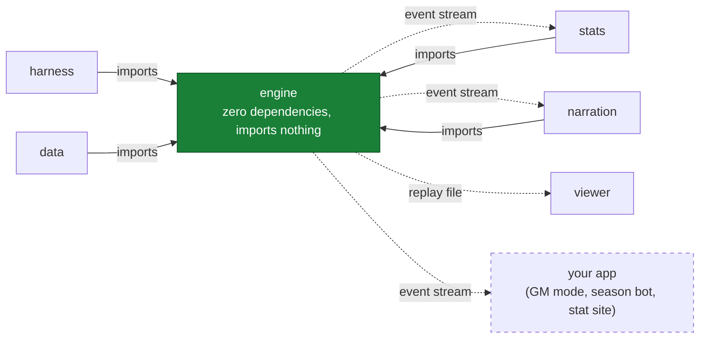
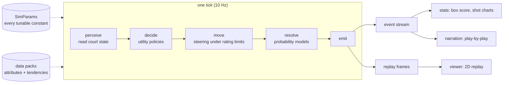

<!-- ============================================================
  GENERATED FILE — DO NOT EDIT.
  This is the hoopsh Bible: all 12 source documents compiled in canonical
  reading order. Edit the sources, then regenerate: npm run docs:bible
  Sources (in order): README.md · ARCHITECTURE.md · docs/INTERNALS.md · docs/CALIBRATION.md · AGENTS.md · docs/PLAYBOOK.md · docs/EMBEDDING.md · docs/ROSTERS.md · docs/SEASON.md · docs/BROADCAST.md · docs/GLOSSARY.md · docs/ONBOARDING.md
============================================================ -->

# 📖 The hoopsh Bible — everything, one file

> Generated from the 12 source documents. If this file and a source document
> disagree, the source is right and this file is stale — regenerate it.

## Contents
1. **README.md**
2. **ARCHITECTURE.md**
3. **docs/INTERNALS.md**
4. **docs/CALIBRATION.md**
5. **AGENTS.md**
6. **docs/PLAYBOOK.md**
7. **docs/EMBEDDING.md**
8. **docs/ROSTERS.md**
9. **docs/SEASON.md**
10. **docs/BROADCAST.md**
11. **docs/GLOSSARY.md**
12. **docs/ONBOARDING.md**


---
---

<!-- ================= SOURCE: README.md ================= -->

> Part 1/12 of the generated Bible — canonical source: `README.md`. Edit there, then `npm run docs:bible`.

# hoopsh

*A modular, deterministic, 2D-spatial basketball simulation core.*

hoopsh simulates a basketball game as ten agents moving on a real court, ten times
per second — spacing, drives, kick-outs, cuts, closeouts, help rotations, box-outs.
Discrete outcomes (shots, passes, fouls, rebounds) resolve through probability
models fed by spatial context. The same seed produces the bit-identical game every
time, so a game is a file you can replay, diff, and share. Every point in a box
score traces back to a simulated shot at an (x, y) location. It is a 2D probability
model with position as an input, not a physics sim: there is no ball height, and
[docs/INTERNALS.md](./docs/INTERNALS.md) keeps the honest list of simplifications.

hoopsh is engine-first: MyPlayer careers, GM/franchise modes, historical what-ifs
("drop Jordan into 2015"), broadcast experiences — all of these are thin apps
consuming one core's event stream. Leagues (NBA, NCAA, EuroLeague) are swappable
**rule packs**; rosters are human-editable **data packs**.

## Quickstart — zero dependencies

All you need is **Node 24+**. No `npm install` — the repo runs directly from
TypeScript source via Node's native type stripping and a tiny loader hook.
The demo is one command:

```bash
git clone https://github.com/alperien/hoopsh && cd hoopsh
npm run sim                      # one game: box score + play-by-play + saved replay
```

Then:

```bash
npm run sim -- --seed my-seed    # deterministic: same seed = bit-identical game
npm run batch -- --games 50      # sim N games, grade vs NBA realism acceptance bands
npm run bench                    # games/sec benchmark (budget: ≥1; hardware-dependent, ~3-6 typical)
npm run test                     # full suite via node:test, zero installs (~2 min)
npm run broadcast                # two-voice broadcast script for a game

npm run roster:new               # scaffold your own team from archetypes (wizard);
                                 # writes out/new-team.team.json by default
npm run roster:validate -- out/new-team.team.json  # pack linting: fixes + plausibility warnings
npm run sim -- --home out/new-team.team.json       # ...and your team plays (docs/ROSTERS.md is the guide)

npm run season -- --teams 8      # deterministic round-robin season + standings (docs/SEASON.md)
npm run season -- --matchup 0,3 --sims 200   # Monte-Carlo one fixture: win prob + CI
```

A note on realism claims: the league-average checks the sim is tuned against
were written down from memory, not generated from sourced data (the play-by-play
references in `data/nba/` are the sourced part — 184 parsed real games). Making
every target citable is an active roadmap item, so this README quotes no pass
rates: run the checks yourself with `npm run batch`.

Optional dev tooling (`typescript`, `vitest`, `tsx`, `@types/node`) is
declared in `devDependencies` so one plain `npm install` reproduces the full
dev environment (`npm run typecheck`, `npm run test:vitest`) — but nothing at
runtime requires it; every command above works on a bare clone.
Note for readers of the test files: they import from `'vitest'`, which is NOT
installed — `tools/hooks.mjs` resolves that specifier to a `node:test`-backed
shim (`tools/shims/vitest.ts`), so `npm test` runs the whole suite with zero
dependencies. Installing real vitest simply takes over via `test:vitest`.

## Watch a game

```bash
npm run sim -- --seed showcase           # writes out/replay-showcase.json
npm run viewer:embed out/replay-showcase.json out/game.html
open out/game.html                       # macOS; Linux: xdg-open, Windows: start
```

Or open `packages/viewer/index.html` directly and **drag any replay JSON onto it**.
Playback controls: space to play/pause, ←/→ to skip ±10s, speed cycling, name labels,
made/missed shot splashes.

## Run a franchise

The GM game: thirty fictional teams, a full CBA (cap, tax, aprons, Bird
rights, rookie scale), AI front offices, a draft with scouting fog of war,
development and injuries, a news desk, and every game of every season
simulated by the engine above, possession by possession.

```bash
npm run gm                       # serves http://localhost:4200; pick a team in the browser
npm run gm -- --load my-league   # boot straight into a save
npm run gm:acceptance -- --seasons 5   # the multi-season league-health report
```

### Or live one career instead

The same app has a second chair: create a seventeen-year-old and climb.
A high-school senior season played possession by possession under prep
rules, recruiting boards that watch your actual box scores, the fork to
college, the EuroLeague, or the NBL, the combine, and a draft night run
by the same AI front offices that run the GM game. After that it is the
real league from the player's side of the desk: a pre-game approach
card projected onto your true tendencies, a coach whose plan you play
inside or against, a phone that only rings when the world has something
real to say, and a role that answers sustained production within six
games, always. Careers are a pure function of `(seed, choice log)`.

```bash
npm run gm                                      # choose "Live a career" on first run
npm run gm:career-acceptance -- --careers 3     # whole scripted careers, judged: gates and bands
```

Advance day by day (the `a` key), set the rotation, work the trade desk,
watch your games as a two-voice broadcast ticker or in the 2D viewer.
Saves are plain JSON under `out/saves/`; a league is a pure function of
(seed, your action log). The design document is
[docs/FRANCHISE.md](./docs/FRANCHISE.md); the module map is
[docs/FRANCHISE_INTERNALS.md](./docs/FRANCHISE_INTERNALS.md).

The viewer needs a browser — there is no terminal renderer. On a headless box
(SSH, CI, an agent sandbox) the game is still readable as text: every
`npm run sim` writes the full play-by-play to `out/pbp-<seed>.txt`, and
`npm run broadcast` renders a two-voice announcer script.

## How it fits together

| Package | What it does |
|---|---|
| `@hoopsh/engine` | Pure, zero-dependency, deterministic sim core (Node + browser) |
| `@hoopsh/stats` | Event stream → box scores, exact minutes/±, advanced stats, shot charts |
| `@hoopsh/data` | Player/team schemas, validation, archetype builders, sample teams |
| `@hoopsh/narration` | Template play-by-play with run/milestone awareness + LLM commentary interfaces |
| `@hoopsh/harness` | Batch runner, NBA acceptance bands, benchmarks, calibration tooling |
| `@hoopsh/franchise` | Deterministic GM/franchise league layer: calendar, CBA, AI front offices, development, injuries, news, history (docs/FRANCHISE.md) |
| `@hoopsh/career` | Deterministic career mode: one created player from the high-school gym to the league and out the far end (docs/CAREER.md) |
| `@hoopsh/app` | The GM game app: local web server, worker-pool game execution, saves, and the browser UI |
| `packages/viewer` | Single-file 2D canvas replay viewer (embed tool + drag-and-drop) |

One rule holds the design together: **`engine` imports nothing; everything else
consumes what it emits.**



Solid arrows are compile-time imports: they all point INTO the engine, which
imports nothing — no npm packages, no `node:` built-ins. Dashed arrows are runtime
data flowing OUT: the typed event stream (`core/events.ts`, the public contract)
and the replay file, which the viewer renders without re-simulating. The engine
never learns who consumes it; a change that makes it aware of a consumer breaks
the arrows, and that is the review test. Full design rationale in
[ARCHITECTURE.md](./ARCHITECTURE.md).

## Build on it

The engine is a library. `simulateGame(config)` returns `{ seed, events,
finalScore, frames, rules, params, teams }`, and the event stream is the same
surface this repo's own box scores, narration, and viewer are built on — a
consumer you write sits at exactly that distance. Natural fits: season bots,
custom stat sites, alternative viewers, GM/career layers, LLM color commentary
(the `CommentaryProvider` seam). The builder's guide is
[docs/EMBEDDING.md](./docs/EMBEDDING.md): loader recipe, `GameConfig`, the
supported API surface, worked examples. The stability contract is
[docs/CONTRACT.md](./docs/CONTRACT.md): the stable surfaces, the explicitly
unstable ones, and what a version bump means.

Input contract: `simulateGame` always rejects non-finite ratings loudly; pass
`validate: 'strict'` to also enforce the data-pack ranges (ratings 0-100) when
rosters come from untrusted sources — the default tier deliberately admits
out-of-range finite values for custom content and stress tests.

## The core bet: hybrid spatial–stochastic simulation

Pure physics sims are hard to calibrate; pure stat sims have no feel. hoopsh runs
continuous 2D movement and decision-making, but resolves discrete events through
logistic models whose every constant lives in one flat object: **`SimParams`**, the
calibration surface. Player identity comes from handcrafted **attributes** (what a
player *can* do) and **tendencies** (what they *want* to do). An elite shooter profile
produces a heavy deep-three diet, off-ball gravity that warps the defense, and
star-level scoring volume as a result of these interactions, without being scripted.

Signature mechanics:
- **Shot windup** — shots take 0.25–0.65s to release, making every catch-and-shoot a
  race against the closeout; shooters *anticipate* the flying defender when judging
  shot quality.
- **Self-consistent AI** — the same model that resolves shots also drives shot
  *selection*, so decision-making and outcomes can never drift apart.
- **Honest defense economics** — sagging off non-shooters works because a rim-runner's
  open 9-foot floater is genuinely a win for the defense.

## Realism status

A batch harness grades league-wide averages against the NBA acceptance bands
in `harness/src/bands.ts` (pace, efficiency, shot mix, rebounding, fouls,
turnovers, assisted share…), and an automated parameter sweep
(`npm run sweep`) re-centers them after mechanics changes. **No static pass
rate is quoted here on purpose — quoted numbers rot.** Measure the current
state yourself: `npm run batch -- --games 40` for one seed base,
`npm run sweep -- --iters 0 --verify 40` for three, `npm run oos` for rosters
the sweep has never seen (plus a distributional report the means can't
capture). Residual misses and open calibration findings are recorded in the
work register, [docs/REGISTER.md](./docs/REGISTER.md), not hidden. The test
suite — including a permanent invariant suite derived from adversarial audit
rounds and an adversarial-input fixture — guards determinism, possession
accounting, minutes conservation, and buzzer integrity on every change
(`npm test` prints the live count). Archetype tests pin player differentiation
(elite shooter ≈ 25 pts on ~20 FGA with a deep-three diet; rim-runner takes 90%+
of shots inside; non-shooting bigs do not take low-value shots).

Run it yourself: `npm run batch -- --games 50`.

## Roadmap

**Done:** deterministic engine with replay viewer and broadcast scripts ·
automated parameter sweep · pick-and-roll, post-ups, dribble-handoffs,
isolation · usage hierarchy (floor generals lead their teams in assists) ·
invariant suite from adversarial audits · real-game corpus (184 parsed NBA
games) grounding the flow references · worker-pool parallel runner
(determinism across worker counts tested) · roster tooling (schema gen,
scaffold wizard, validator, stats→ratings fitter) · stateless season driver +
Monte-Carlo matchups (docs/SEASON.md) · late-game management (timeouts,
intentional fouling, hold-for-last, two-for-one, clock burn) — on by default,
a decision made on measured evidence · score pressure that couples the
scoreboard back into play (trailing teams press up; decided games wind down
through the benches) · an NCAA rule pack behind the harness `--league` flag
(rule coverage partial).

**Now — closing measured gaps.** The mechanics above are implemented and
wired; current work lands measured increments against named gaps. The
biggest: the sim still moves the ball less than real teams do. The mechanism
built to fix that is no longer parked at zero strength. Three priced
increments shipped it. W69 flipped the probe (concept 8) live with a
pressure fade that yields exactly where the score-pressure coupling
expresses; the fade is the shipped answer to the interaction that had parked
it. W74 made the chooser price a receiver's shot at the catch clock, not the
throw clock (concept 12). W75 re-priced pass risk at -3.75 under a sweep
re-center. Measured at that landing: texture 1.61 to 1.82-1.86 passes per
possession vs the corpus 2.84-2.86, about a fifth of the gap closed. The
remainder is structural supply, not pricing. The next supply-side front, the
transition leak-out (W77), is wired and staged behind a dose dial; its flip
is blocked on an unassisted-rim prerequisite arc. Those records and every
other open item live with their measurements in the work register:
[docs/REGISTER.md](./docs/REGISTER.md). Project terms ("staged", "sweep",
"band lock"…) are defined in [docs/GLOSSARY.md](./docs/GLOSSARY.md).

**Next — validation:** 30-roster league fitting off the corpus · blind
"real or simulated?" play-by-play trials · prediction backtests (Brier score,
calibration curves) via the season layer · sourced NBA data in-repo with
provenance, so bands are generated from data instead of typed from memory ·
distribution-level fitting with a held-out season the solver never sees.

**Landed above the engine:** the GM/franchise game (see "Run a franchise")
took the cross-game seams SEASON.md documented and built on them: fatigue
carryover, injuries, progression & aging, home-court advantage, plus the
league office and the paper trail. Its own register of simplifications
lives in docs/FRANCHISE.md §13.

**Beyond:** EuroLeague rule pack + NCAA calibration · era packs (1995 vs
2015 shot diets) · deep player editor UI · MyPlayer experiences ·
defensive schemes · broadcast TTS audio · G-League game simulation ·
WASM hot path if the perf budget ever demands it.

## Documentation

Everything routes through the hub: **[docs/README.md](./docs/README.md)** —
every document, reading paths by role, which doc answers which question.
Contributing code? Humans start at [CONTRIBUTING.md](./CONTRIBUTING.md), AI
agents at [AGENTS.md](./AGENTS.md) (the covenant; its rules bind everyone).
The verification gates for each change tier are one page:
[docs/CHECKLISTS.md](./docs/CHECKLISTS.md).
The whole doc set compiled into one generated file:
[docs/BIBLE.md](./docs/BIBLE.md).

## License

MIT — see [LICENSE](LICENSE).


---
---

<!-- ================= SOURCE: ARCHITECTURE.md ================= -->

> Part 2/12 of the generated Bible — canonical source: `ARCHITECTURE.md`. Edit there, then `npm run docs:bible`.

# hoopsh — Architecture

*A modular, deterministic, 2D-spatial basketball simulation core.*

> Everything here is designed so that **experiences** (MyPlayer careers,
> GM/franchise, historical what-ifs, broadcast viewing) are thin applications built
> around one engine — never entangled with it.

---

## 1. Design goals

1. **Realistic outputs.** Season-scale averages for a given ratings profile should
   land inside that player's real-life statistical range. League-wide aggregates (pace,
   efficiency, shot mix, rebounding, turnovers) must sit inside acceptance bands derived
   from real league data.
2. **Handcrafted identity.** Players are defined by human-editable **attributes**
   (what a player *can* do) and **tendencies** (what a player *wants* to do). No opaque
   learned blobs: every knob is inspectable, editable, shareable as a data pack.
3. **Modular and expandable.** Leagues are **rule packs** (NBA / NCAA / EuroLeague /
   custom). Rosters are **data packs**. Narration, stats, UIs, and future experiences are
   **consumers of the event stream** — the engine never knows they exist.
4. **Deterministic.** Same seed + same inputs ⇒ bit-identical game, every time, on every
   platform. Non-negotiable for debugging, calibration, and replay sharing.
5. **Fast.** Target ≥ 1 full game/second/core in Node. Calibration sweeps run thousands
   of games; speed is a feature.

## 2. The core bet: hybrid spatial–stochastic simulation

Pure physics sims are hard to calibrate; pure stat sims have no feel. hoopsh runs a
**continuous 2D spatial layer** (movement, spacing, defensive positioning) and resolves
**discrete events probabilistically** (shots, passes, fouls, rebounds) using models fed
by spatial context:

```
tick (10 Hz):
  1. perceive   — each agent reads court state (ball, matchups, openness, clock)
  2. decide     — utility-based policies pick actions (attributes + tendencies + tactics)
  3. move       — steering integration under speed/accel limits derived from ratings
  4. resolve    — scheduled discrete events fire through probability models
  5. emit       — events append to the game's event stream; frames append to the replay
```

The same pipeline as a picture. The two dotted inputs are the only tuning
surfaces (global constants in `SimParams`, per-player attributes and tendencies
in data packs); everything downstream hangs off two append-only outputs and
never reaches inside the loop:



The probability models take spatial inputs (shot distance, contest level, closing speed,
passing-lane geometry) and player ratings, and **every constant lives in `SimParams`** —
a single tunable parameter object. That is the calibration surface. Realism becomes a
measurable optimization problem: tune `SimParams` until league aggregates hit acceptance
bands, while archetype tests pin player differentiation.

Two layers of knobs, deliberately separated:

| Layer | Examples | Tuned by |
|---|---|---|
| Global (`SimParams`) | base make-prob per zone, foul rates, rebound geometry, decision temperatures | calibration harness, vs league data |
| Player (ratings → modifiers) | rating curves mapping 0–100 skills into model coefficients | archetype test suite |

A third layer — **era packs** — can later override global tendencies (1995 shot diet vs
2015 pace-and-space), which is exactly what "drop Jordan into 2015" needs.

## 3. Package layout (npm workspaces monorepo)

```
packages/
  engine/      pure, zero-dependency, deterministic sim core (Node + browser)
  stats/       event stream → box scores, advanced stats, shot charts
  data/        player/team JSON schemas, validation, sample fictional rosters
  narration/   template play-by-play + LLM color-commentary interfaces
  harness/     batch runner, acceptance bands, benchmarks, calibration tools,
               season/matchup driver, stats→ratings fitter (docs/SEASON.md,
               docs/ROSTERS.md)
  viewer/      single-file 2D canvas replay viewer (working prototype; frozen)
```

Dependency rule: `engine` imports nothing. Everything else imports `engine`.
Experiences (GM, MyPlayer, editor UI) will live outside these packages and speak to the
engine only through its public API: `simulateGame(config) → GameResult` (`{ seed, events, finalScore, frames, rules, params, teams }`; a `Replay` is assembled separately from that result via `buildReplay`).

## 4. Engine internals

### 4.1 Coordinates, units, time

- Units: **feet**, seconds. Court is `length × width` from the rule pack
  (NBA: 94 × 50). Origin at the home baseline's left corner; x along the court length.
- Hoops at `(rimInset, width/2)` and `(length − rimInset, width/2)`; NBA rim inset 5.25 ft.
- Tick rate `10 Hz` (a `SimParams` knob). A 48-minute game ≈ 28,800 ticks.

### 4.2 Rule packs

`RulePack` is data, not code: period count/length, OT length, shot clock (+ offensive
rebound reset), team-foul bonus thresholds, personal foul-out limit, three-point
geometry (arc radius, corner distance, corner break), court dimensions, clock-stopping
rules. NBA ships first. An NCAA pack exists and is selectable through the
harness `--league` flag (rule pack + bands + pace basis travel together);
its rule coverage is partial — unwired fields are labeled in
`rules/rulepack.ts` and registered in [docs/REGISTER.md](./docs/REGISTER.md).
EuroLeague is a follow-up. Custom leagues are just JSON.

### 4.3 Player model

- **Attributes (0–100):** physical (speed, accel, strength, vertical, lateral quickness,
  stamina, height/wingspan as real measurements) and skills (finishing, mid, three,
  free throw, ball-handle, pass accuracy/vision, perimeter/interior defense, steal,
  block, off/def rebounding, box-out, contest, decision speed, consistency).
- **Tendencies (0–100):** shot diet by zone, pull-up vs catch-and-shoot, drive/pass-out/
  iso/post frequencies, off-ball movement styles (spot-up, cut, screen), crash vs
  get-back, defensive gamble, foul aggression, tempo push.
- **Derived quantities:** ratings map to physical/model units through documented curves
  in `model/derived.ts` (e.g. speed 0–100 → max sprint ft/s). These curves are part of
  the calibration surface.

"Curry-ness" = elite three ratings + heavy three/pull-up tendencies + high off-ball
movement + gravity (defenses guard him tighter, farther out, which creates the
spacing his teammates feed on). Identity is a product of this interaction, not a script.

### 4.4 Offense AI

- Formation spots from a tactics template (5-out / 4-out-1-in chosen from personnel).
- Ball-handler policy scores `{shoot, drive, pass(x4), reposition}` each decision window:
  - Shot utility = predicted make prob (same model that resolves shots — the engine is
    self-consistent) × shot value + foul-draw EV, weighed against the possession's
    remaining continuation value, which decays as the shot clock drains. Late-clock
    heaves and early good-shot-taking emerge naturally.
  - Drive utility from lane openness; help convergence spikes kick-out utility —
    drive-and-kick emerges without scripting.
- Off-ball: hold/relocate to spacing spots, cut when lanes open, simple pick-and-roll
  action (screen delay on the on-ball defender; screener rolls or pops by tendency).

### 4.5 Defense AI

Man-to-man v1: positioning on the man–rim line, sag depth from shooter gravity and ball
distance (help side), closeouts on the catch, help rotation when a drive beats the
primary defender, contest quality from distance/closing speed/length at release.
Schemes (drop vs switch PnR coverage, zones) are later modules behind the same interface.

### 4.6 Rebounds, fouls, transition

- Miss location sampled by shot distance (long misses rebound long), then a weighted
  contest among boxout/positioning/athleticism of nearby players. Putbacks emerge.
- Foul models: shooting fouls (contest tightness, zone, defender aggression), reach-ins,
  charges (rare). Team-foul bonus and foul-outs from the rule pack. FT sequences.
- Live-ball turnovers and defensive rebounds trigger transition: if the defense isn't
  set, early-offense quality bonuses apply. Fast-break points emerge.
- Endgame management (timeouts, intentional fouling, hold-for-last, two-for-one,
  clock burn) is a layer that modulates the same EV framework rather than
  scripting plays (`GameConfig.endgame`). Default ON; `endgame: false`
  preserves the byte-identical legacy path. Its magnitude dials sit on the
  calibration sweep surface like any other `SimParams` constants; its
  window/threshold dials are design decisions, not calibration, and stay off it.
- Game-state coupling: the scoreboard feeds back into play all game, not just
  in the endgame windows. The trailing team's defense presses up and the
  leader's sags off — the same containment/closeout models that price every
  contest, leaned by the margin (concept 7 in the AI layer) — so margins
  mean-revert the way real ones do instead of diffusing without bound. The
  defensive channel is the one that ships: an offensive press/coast tilt is
  also wired, measured distribution-null, and stays at zero. Decided games
  additionally trigger a garbage-time concede rotation (`sim/subs.ts`): past
  a clock-scaled safe-lead line, both benches close the game out — leader
  first, with hysteresis so lineups never flip-flop — resting starters and
  stopping blowouts from growing to the horn. The concede requires the live
  coupling (uncoupled, bench-vs-bench endings measured margin-expanding).
  Magnitudes were fitted by measurement; the current measured state lives in
  [docs/CALIBRATION.md](./docs/CALIBRATION.md), open residuals in
  [docs/REGISTER.md](./docs/REGISTER.md).

### 4.7 Event stream & replay

Every discrete outcome is a typed event (`shot`, `pass`, `rebound`, `turnover`, `foul`,
`free_throw`, `substitution`, `violation`, period markers) carrying game clock, shot
clock, score, and spatial coordinates (shots carry x/y for shot charts). The replay file
= metadata + downsampled position frames + the event list; the viewer renders it without
re-simulating.

### 4.8 Determinism

One seeded PRNG (sfc32) owned by the game; no `Math.random`, no `Date.now`, no float
nondeterminism from iteration order. Tests assert bit-identical event streams for fixed
seeds.

## 5. Realism: how "Curry averages like Curry" actually gets enforced

1. **League acceptance bands** (harness): sim N games between balanced rosters; assert
   pace, points, FG%/3P%/FT%, 3PA rate, FTA rate, ORB%, TOV%, assists, steals, blocks,
   fouls all inside acceptance bands (author-recalled ranges today; sourcing them from real league data is an active roadmap item — see README).
2. **Archetype tests** (engine test suite): hand-built extreme profiles must produce the
   right *shape* of stat line — the elite shooter's 3PA share, the rim-runner's points
   at the rim, the floor general's assist rate. Direction and band, not exact values.
3. **Star fixtures**: full ratings profiles for star archetypes simmed over seasons;
   assert the sim distribution overlaps the player's real-life season range (real
   players vary year to year — that variance defines honest tolerance).
4. **Parameter search**: `SimParams` is a flat, serializable object precisely so the
   harness can grid/random-search subsets of it against the acceptance report.

Calibration order matters: pace → shot mix → efficiency → fouls/rebounds/turnovers →
archetype differentiation. Each stage locks before the next tunes.

## 6. Narration layer

Consumes the event stream; never touches the engine.

1. **Template PBP** — every event rendered to text with variety pools, seeded selection,
   repeat-avoidance, and context trackers (scoring runs, lead changes, milestones,
   clutch time).
2. **`CommentaryProvider` interface** — receives windows of events + narrative context
   (storylines, box score snapshots, momentum) and returns color commentary. LLM-backed
   implementations plug in here; the template layer is the zero-cost fallback.
3. **Broadcast audio** (roadmap) — two-voice play-by-play + color scripts rendered to
   TTS for highlight reels and quarter recaps.

## 7. Performance budget

- ≥ 1 game/sec/core single-threaded in Node (bench harness tracks this from day one).
- Batch runner parallelizes across worker processes; determinism preserved per-game
  (each game owns its seed, so parallel order can't change results).
- If the budget ever breaks against a future feature: hot loops port to Rust/WASM behind
  the same TypeScript API. Nothing above the engine notices.

## 8. Roadmap

One roadmap, kept in [README.md](./README.md#roadmap). The live work
register — open items, with their measurements — is
[docs/REGISTER.md](./docs/REGISTER.md).


---
---

<!-- ================= SOURCE: docs/INTERNALS.md ================= -->

> Part 3/12 of the generated Bible — canonical source: `docs/INTERNALS.md`. Edit there, then `npm run docs:bible`.

# hoopsh internals — a guided tour

Read [ARCHITECTURE.md](../ARCHITECTURE.md) first for the *why*; this is the *where*.
The terse names the code uses (`n()`, `t`/`wt`, `sc`, the one-letter params
aliases) are decoded once in [GLOSSARY.md](./GLOSSARY.md).
Everything below assumes the governing rule: **`engine` imports nothing; everything
else consumes its event stream.**

## The tick pipeline (10 Hz)

```
simulateGame(cfg)
 └─ tick(dt)                                 sim/game.ts
     ├─ wallT += dt                          (replay timeline: never pauses)
     ├─ phase dispatch:
     │   live        → tickLive              sim/game.ts
     │   dead        → tickDead              sim/possession.ts
     │   freethrows  → tickFreeThrows        sim/fouls.ts
     │   scramble    → tickScramble          sim/possession.ts
     └─ recordFrame                          sim/game.ts

tickLive, in order:
  advanceClock (game clock; stops at the horn) → ball flight? resolve on arrival
  → period expiry → shot-clock violation check → windup in progress?
  → possession phase transitions → holder movement intent → dribble accounting
  → decideBall() at each decision window → executeAction → reach-in checks
  → charge check → offense/defense brains → integrateMovement → fatigue
```

**Two time axes.** `t` is game-clock time (stops at whistles and the horn; stats and
minutes key on it). `wallT` is the replay timeline (advances every tick; frames and
event `wt` key on it). Do not mix them.

## Module map — `packages/engine/src/`

| File | Owns | Start here when changing… |
|---|---|---|
| `sim/game.ts` | orchestrator: init, tick dispatch, live tick, movement intents, frames | tick order, decision cadence, replay frames |
| `sim/possession.ts` | possession lifecycle, dead balls, scrambles, periods, tip | pace accounting, inbounds, period/OT rules |
| `sim/shooting.ts` | windup → release → resolution, assists | anything between "decides to shoot" and the rim |
| `sim/passing.ts` | pass flight, steals/OOB, reach-ins | turnover mechanics |
| `sim/fouls.ts` | foul bookkeeping, bonus, FT sequences | whistle rules |
| `sim/subs.ts` | lineup swaps, fatigue rotation, foul-out replacement, garbage-time concede (LIVE: final-period clock-scaled margin line + hysteresis, both benches close decided games, leader first; requires the live coupling — provenance in `params.ts` `sub.concede*`) | rotations, garbage time |
| `sim/movement.ts` | clock advance, physical integration, collision, fatigue | locomotion, energy |
| `sim/ai.ts` | **all basketball behavior** — the stable barrel over `sim/ai/` | start below, per layer |
| `sim/ai/decide.ts` | decideBall: ball-handler utilities + softmax | shot selection, pass choice, drives |
| `sim/ai/concepts.ts` | the bounded-rationality layer, consolidated (drilled-behavior bias terms; concept 6 = game-state urgency: clock kill, hold-for-last, two-for-one; concept 7 = score pressure: channel-1 continuation tilt wired but MEASURED NULL, ships at 0 — channel-2 defensive intensity LIVE at `scorePressureDefGain` 0.3; concept 8 = probe culture, STAGED at zero magnitudes; concept 9 = opening set, LIVE since the FLOW flip; concept 10 = OREB scramble economy, LIVE — both under "Flow-program families" below) | decision bias terms, late-clock behavior, game-state coupling |
| `sim/ai/actions.ts` | pnr/post/iso/dho lifecycle | calling & phasing team actions |
| `sim/ai/offense.ts` | spacing spots, cuts, screens, shot-reaction crash/boxout | off-ball offense |
| `sim/ai/defense.ts` | matchups, help, blitz, drop, containment, denial, sag; the on-ball containment gap + closeout slack consume concept 7's channel-2 score-pressure lean | defensive positioning |
| `sim/ai/shared.ts` | creation hierarchy, defender queries, locomotion policy | cross-layer queries |
| `sim/endgame.ts` | endgame layer (`GameConfig.endgame`, **default ON** since the n=1260/arm flag-on survey; explicit `endgame: false` is the byte-identical legacy path): timeout brain (plus the game-wide timeout economy since the FLOW flip — below), intentional-foul targeting, chase arithmetic shared with concept 6 | late-game management |
| `sim/resolve.ts` | probability models: shots, contests, passes, rebounds | make/miss math |
| `sim/params.ts` | **every tunable constant** — the composed calibration surface: `SimParams`, `defaultParams`, `paramProvenance`, `withParams` (#36 split) | calibration; never hardcode a constant elsewhere |
| `sim/params.<block>.ts` | one module per block (`shot` `foul` `pass` `reb` `decide` `move` `fatigue` `sub` `endgame` `officiating` `ai`): the block's interface, calibrated defaults, and per-knob provenance map | an individual knob's value, docs, or provenance |
| `sim/params.provenance.ts` | the `Provenance` tag vocabulary (`REAL`/`SWEPT`/`FEEL`) and the #36 adjudication rules | what a provenance tag means |
| `sim/state.ts` | shared types + `emit()` | event stamping, new state fields |
| `core/events.ts` | the event schema — **the public contract** | anything consumers see |
| `core/rng.ts` | seeded sfc32 + distributions | never use Math.random |
| `geometry/court.ts` | court build, shot zones, spacing spots | three-point geometry |
| `rules/rulepack.ts` | league packs (NBA/NCAA/EURO) | league differences |
| `model/player.ts` | attributes & tendencies (the 38 dials) | the editable surface |
| `model/derived.ts` | rating → physical-unit curves | what "90 speed" means |
| `replay/replay.ts` | replay JSON assembly | viewer data needs |

Flow-program families, live since the FLOW flip (`853ebd1`; wired
STAGED-inert first, byte-identity proven against the golden corpus). Every
rate and magnitude lives in `sim/params.ts` — that file is the source of
truth; values quoted below are identity anchors only.

Officiating vocabulary (`params.officiating`; event kinds `jump_ball`,
`violation`, replay reviews — replay format v3, with the box/narration/viewer
consumer chain): kicked balls at pass arrivals (passing.ts), held-ball jump
balls at rebound scrambles and on-ball reach-ins (possession.ts / passing.ts;
an offense-retains tie-up floors the shot clock like an offensive board),
defensive/offensive goaltends (shooting.ts / the putback branch), travel
hazards on committed drive and post time (game.ts), technicals after foul
whistles (fouls.ts), take fouls (the endgame-hunt relabel plus the
beaten-in-transition window, passing.ts), replay reviews at flagged dead
balls, late makes, and period ends (possession.ts; wallT-only stoppages —
the game clock never moves). The rates are corpus-fitted REAL targets
(ffit-officiating) and deliberately NOT in `harness/knobs.ts`: the 17-band
sweep measures no officiating statistic and would trade them to zero to
relieve the tov/pf ceilings; the flowboard G2 gate owns them instead.

Concept 9 (opening set) raises the shoot/drive bar on a period's first
possession only — never the pass channel, never the continuation
(`ai.openerShootMalus` 0.55 after the post-audit re-fit, drives paying
`openerDriveShare` 0.75 of it; openers start from a real formation via the
period-break re-set). Concept 10 (scramble economy) is the
putback/continuation family after a player OREB: a putback shoot term and a
kick-out pass term priced against the post-OREB continuation, plus the M2a
supply half — one hard perimeter refill behind the grab (`ai/offense.ts`
onOrebSecured). Flowboard G3/G4 gate them (the G4 kick-3 supply residual is
REGISTER W57).

Timeout economy (`params.endgame` `to*` dials; `endgame.ts` decideTimeout
plus the possession.ts dead-ball/live sites; the budget stays in
`rules.timeoutsPerGame`): mandatory (TV) stoppages at the NBA Rule 5 VI(b)
anchors, the REAL Q4/late/OT caps, the coach voluntary-timeout hazard
(run- and trail-pressure weighted, cooldown, quarter-open quiet window,
pre-cap burn), and the live-ball site (defensive board or steal, called
before the advance). Corpus-fitted (ffit-timeouts); flowboard G1 gates
volume and quarter coverage. The legacy stop_run trigger is retired in
place at `timeoutRunPts` 999 — the hazard subsumes it; the param and the
endgame.ts branch that still reads it go together when removed.

Consumers: `stats/box.ts` (events → box score, exact minutes/±; official-convention
FGA — no attempt charged on a shooting-foul miss, `5d9671f`), `data/` (schemas,
validation, archetypes, sample packs), `narration/` (template PBP + the booth
— a two-voice broadcast pipeline: `sense.ts` GameSense fold → `beats.ts`
tags/heat/registers → `booth.ts` turn-taking director → `voice.ts` +
`personas.ts` voice packs (Corbin/Tremaine/Boone; design doc
docs/BROADCAST.md); speaks the full flow vocabulary incl. mandatory
timeouts and held-ball jumps; `shotcall.ts` classifies which basketball
NAME an attempt gets — layup/dunk/hook/tip-in/jump shot — from ShotEvent
data alone),
`packages/viewer/` (frozen prototype).

Harness map — `packages/harness/src/` (measurement and tooling; rows for the
modules an agent is likely to be pointed at):

| File | Owns |
|---|---|
| `bands.ts` + `cli.ts` | the NBA acceptance bands (count them HERE, per AGENTS §4.4) + the gated batch runner |
| `sweep.ts` / `knobs.ts` / `solve.ts` | parameter search over SimParams (margin objective) |
| `noisefloor.ts` / `calreport.ts` | measured noise floor (40 bases → `noise-floor.gen.ts`); n40 center positions vs band edges |
| `fidelity.ts` | star-fixture identity gates (Curry/LeBron/Jokić profiles) |
| `texture.ts` | frame-level feel forensics: speeds, stillness, ping-pong passing |
| `flow.ts` + `flow-metrics.ts` | game-arc forensics + event grammar (CLI/report + doctrine in flow.ts; pure metric library in flow-metrics.ts) |
| `turing.ts` | blind PBP discrimination protocol vs real bbref logs; also exports the matched-representation neutral schema (`NeutralRow`) the flowboard measures on |
| `scoreboard.ts` | the flowboard (`npm run flowboard`): the flow program's 13-gate judgment instrument — T1/T2 blind discrimination by a deterministic in-repo statistical judge over the neutral schema, plus gates G1-G11 (timeout volume, officiating rows, opener/heave/sub grammar, rebound cadence, shot diet — dead-ball/texture structure the enforced flow gates cannot see). One algorithm, two adapters: the corpus side is live-computed from the committed 184-game shards at print time, never hand-typed; writes `out/scoreboard.json` |
| `oos.ts` | out-of-sample generated-roster bands + the distributional report |
| `season.ts` / `matchup.ts` / `league.ts` | season driver + standings, Monte-Carlo matchup distributions, deterministic fictional leagues — see `docs/SEASON.md` |
| `leagues.ts` | league selection: one id resolves rule pack + bands + pace basis TOGETHER (`--league`; prevents grading NCAA play against NBA bands) |
| `parallel.ts` | worker-pool game runner; determinism across worker counts is the acceptance test |
| `fingerprint.ts` | golden fingerprint corpus — the pure-refactor byte-identity tripwire (default mode, run locally) and the CI determinism gate (`--determinism`: corpus double-built in-process, the two runs must match; not a gameplay gate since issue #33) |
| `fit-roster.ts` | stats → ratings inversion (`rosters:fit`): real box lines → validated 38-dial packs |
| `args.ts` | shared loud CLI flag parsing (exists because of the silent `--seed` incident) |
| `reanchor.ts` | the seed-pin re-anchor helper (issue #50): verifies every `seed-pins.gen.ts` anchor — the W54/W56 pinned-fixture class consumed by events/subs/timeouts/leakout (engine), season (harness), pbp (narration) — against the current streams; `--write` re-scouts stranded anchors per each pin's documented doctrine, rewrites the generated anchor files, and re-runs the consuming tests as confirmation. Never edits a test or lowers a floor; REFUSES (exit 1) when a scan exhausts or a collapse discriminator trips (per-pin guards against laundering a dead mechanism through lucky seeds — the review #88 finding; doctrine audit in the file header). Confirmation red is classified: managed failures restore and exit 1; failures matching only the KNOWN_UNMANAGED registry restore too unless `--keep-unmanaged-red` keeps the re-anchor and exits 2, loudly listing the remaining hand tax |

Roster-authoring tooling (`tools/gen-schema.mjs`, `roster-new.mjs`,
`roster-validate.mjs` — `npm run schema:gen` / `roster:new` / `roster:validate`)
sits outside the packages: it consumes `@hoopsh/data`'s exported schema
definitions and archetypes, and emits/validates the hand-edited packs. The
editor JSON Schema at `data/schema/team-pack.schema.json` is GENERATED — see
`docs/ROSTERS.md` for the authoring loop and `packages/data/src/schema.ts` for
the single source of truth it derives from.

## Design rules that maintain consistency across this codebase

1. **One probability form.** Every resolution is `sigmoid(base + Σ terms)`; every
   constant lives in `SimParams`. Rating influence goes through `n(rating)` ∈ [-1, 1].
2. **Self-consistent AI, plus a bounded-rationality layer.** The model that
   resolves a shot is the model the AI uses to *choose* it (`shotEV` calls
   `shotMakeP`) — the EV core cannot drift from reality. On TOP of that core,
   decideBall applies deliberate non-EV bias terms (catch-and-shoot
   decisiveness, action patience, usage pressure, …): real players are not
   EV-optimizers, they run drilled behaviors, and each term models one. This
   is a DESIGN DECISION with a maintenance cost — the terms accumulate per
   mechanic and are due for consolidation into fewer principled concepts, and
   the decision-vs-EV divergence should be measured, not assumed small (both
   tracked on the roadmap).
3. **Determinism is mandatory.** One seeded `Rng` per game. No `Math.random`, no `Date`,
   no iteration-order dependence. Same seed ⇒ bit-identical events + frames.
4. **Events are the only truth.** If a consumer needs something, it goes in the event
   stream — never reach into engine internals.
5. **Actions are thin scaffolding.** Pick-and-roll sets up geometry (screen contact,
   stun, roll); the payoff (pull-up space, pocket pass) *emerges* from existing systems.
   The post-up follows the same shape: the entry reuses the pass model, the double-team
   reuses help defense, and the spray out of the double reuses kick-out machinery.
6. **Staged surface is labeled.** Fields marked `STAGED` in `model/player.ts`
   (`consistency`, `tend.pushPace`, `Tactics.pace`) are defined but not yet
   consumed — each is tied to a roadmap stage (the pace pair belongs to the same
   team-pace layer). Wiring one without its stage's mechanics adds unvalidated
   surface area.

## The safety net (run all of it before pushing)

```bash
npm run test     # full suite: determinism, geometry, archetypes, narration, schema,
                 # wide-band realism guard, and the INVARIANT SUITE (below)
npm run batch -- --games 24    # fine-grained NBA acceptance bands
npm run bench    # ≥1 game/sec budget (throughput is hardware-dependent — measure locally, don't quote).
                 # Its events lines (avg/total/per-game/sig) are the opposite: pinned by the tree,
                 # byte-reproducible at the same commit + Node version, and labeled with both
                 # (`tree:`/`node:` contract lines). Compare events figures across boxes only at an
                 # identical contract; a same-tree mismatch means a dirty/mismatched checkout or a
                 # determinism break (incident #175).
```

`packages/engine/test/invariants.test.ts` permanently enforces what two adversarial
audit rounds verified: possession start/end balance, zero post-horn scoring, exact
minutes conservation, plus-minus ≡ margin×5, score reconstructible from events, no
off-court or fouled-out actors, team-foul monotonicity, strictly monotonic replay
frames, and a physical teleport ceiling on player movement. **Policy: if a change to
the engine makes an invariant fail, the change is treated as wrong — never the
invariant.**

`packages/engine/test/adversarial.test.ts` pins the input contract: non-finite
ratings throw at the `simulateGame` boundary (tier 'finite', always on),
`validate: 'strict'` additionally enforces the data-pack ranges, a stalled
game throws instead of faking a `game_end`, and extreme-but-finite rosters
complete with invariants intact.

## Calibration

The calibration workflow, the noise-floor doctrine, what "locked" does and
does not claim, and the CURRENT measured state all live in
[CALIBRATION.md](./CALIBRATION.md) (split out of this file 2026-07-29 —
it had grown a 600-line measured-state journal; superseded eras are in
[history/calibration-eras.md](./history/calibration-eras.md)).

## Known simplifications (deliberate, documented)

Simplified inbounds (timed reset, no inbound passer) · endgame management
(timeouts, intentional fouling, hold-for-last, two-for-one, clock burn) is
implemented and DEFAULT-ON since the calib/integration landing
(`endgame: false` = the byte-identical legacy path); the game-wide timeout
economy (mandatory/TV anchors, the coach voluntary hazard, the live-ball
site) is live since the FLOW flip, corpus-fitted and gated by flowboard G1 —
ATO play-calls remain unmodeled · no backcourt/
8-second violations (travels exist as officiating-vocabulary hazards) · the NBA
last-2:00 team-foul penalty, the OT bonus threshold drop, and the per-period
made-basket clock stops ARE modeled since the rules landing (rulepack.ts
`lateWindow*`, `teamFoulBonusAtOT`, `makeStopClock*`; REGISTER W63) ·
team-foul counting hardcodes the NBA rule under every pack (offensive fouls
are personal-only, sim/fouls.ts `countsTeam`): under NCAA men's rules a
player-control foul DOES count toward the team-foul/bonus total (while never
awarding shots), so the NCAA pack under-counts toward its 7/10 thresholds —
mechanizing it needs a rulepack field (a10 contract scan F5) ·
the offensive-rebound shot-clock reset FLOORS at shotClockOffRebSec
(`Math.max`, sim/possession.ts — a board with 20 s left keeps 20) where the
real NBA/FIBA rule resets TO 14 unconditionally on a rim-contact miss; the
difference binds only on early-clock misses (small pace bias; changing it is
a calibration-ladder change — a10 contract scan F6) ·
(the Stage 2 assists/assisted-share gaps are CLOSED: usage pressure,
delivery quality, and DHO conversion brought assisted share to ~57-61% and
the band is now enforced like any other — see the fidelity-phase commits) ·
man-to-man with drop coverage, plus top-lock denial of extreme-gravity shooters (and its backdoor-cut counter) ·
shotEV prices the shooting-foul EV unconditionally while resolution awards a
whistle only when a contester exists (shooting.ts gates on `contest.by`), and
skips the blockedFoulMult damping — a wide-open look carries ~0.15 phantom
foul EV at the rim and every pass valuation (contest hardcoded `by: null`)
includes it; bands are calibrated around the bias, so making shotEV
realizability-aware is a re-calibration change, not a patch (a6 line audit) ·
bench-exhausted foul-outs play on (NBA rule analog: a fouled-out player remains
when no substitute exists — reachable only with short/foul-storm rosters; the
no-fouled-out-actors invariant applies whenever replacements exist, and every
lineup-consuming site falls back consistently rather than crashing — hardened
after the Stage 2 adversarial audit) ·
narration is a maintained layer (wave-1 polish: shot-call
classification, bbref-register turing renderer; the booth landed as its
second pipeline — docs/BROADCAST.md); the viewer is a frozen prototype.


---
---

<!-- ================= SOURCE: docs/CALIBRATION.md ================= -->

> Part 4/12 of the generated Bible — canonical source: `docs/CALIBRATION.md`. Edit there, then `npm run docs:bible`.

# Calibration — workflow, doctrine, and the current measured state

Split out of `docs/INTERNALS.md` (which now carries only the module map,
design rules, and safety net) and AGENTS §4.4. This file is law for anyone
touching `sim/params.ts` values, `harness/src/bands.ts`, or mechanics that
consume them — read it together with AGENTS §4 (the verification ladder and
tiers). Superseded measured-state eras live in
[history/calibration-eras.md](./history/calibration-eras.md); only the
current state is documented here.

## The workflow

1. Change mechanics → `npm test` (invariants + wide guard must stay green).
2. `npm run batch -- --games 24` → see which bands drifted.
3. `npm run sweep -- --iters 14 --cands 4 --games 12 --verify 40` → let the optimizer
   re-center; bake the printed diff into `params.ts` defaults (keep the odd
   precision); verify with `npm run sweep -- --iters 0 --verify 40`.
4. Regenerate the noise floor: `npm run noisefloor` writes the sampling
   distribution of every gated statistic (`noise-floor.gen.ts`) and the
   permanent gates derive widths from it. Its diff is the accepted-drift
   record.

## Etiquette and the noise floor

- The NBA bands (`harness/src/bands.ts`) are the gate — count them there,
  never from memory (the list grows).
- The noise floor is MEASURED, not guessed: `npm run noisefloor` samples
  every gated statistic across independent seed bases at the gates' sample
  sizes and writes `noise-floor.gen.ts`; the permanent gates derive their
  widths from it (edge ± z·sd, z=3), so a gate failure means "the sim
  changed", not "the seed changed".
- Never adjudicate anything from one or two draws — that is chasing noise
  (measure more bases instead); never hand-nudge what the sweep owns; never
  quote a stale pass-rate in docs — state where to measure it instead.
- A center sitting on or outside a band edge is a systematic finding for
  this file even while the z-gate passes — record it in the measured-state
  section below.
- After the sweep prints a diff, bake it into `params.ts` defaults (keep the
  odd precision), then re-verify with `--iters 0`.

## What "locked" does and does not claim

"Locked" means: at 40+ games, every band's measured CENTER sits inside its
band. The bands are league-mean aggregates on the repo's own rosters, and
the sweep tunes the same knobs the bands grade — so a locked state
demonstrates the model CAN express modern-NBA averages, not that it is
identified (with 100+ free parameters against ~17 loose constraints, many
parameterizations pass). Held-out validation is the fidelity suite
(player-level, profiles authored independently of the sweep) and the
out-of-sample roster check in the harness; distributional realism (score
variance, blowout rate, quarter profiles) is reported but not yet enforced.
Treat band-locked as "necessary, not sufficient".

## Current measured state

Magnitudes from `npm run noisefloor`; positions from `npm run calreport`,
which quotes n40 grand-mean centers with standard errors — quoting a
smaller nested window's mean as "the center" was an error the third review
caught, twice, in our own write-up.

**PASS-VOLUME + RIM-SUPPLY ERA — measured 2026-07-31, recorded 2026-08-01
at main `34ccb6c`.** Four engine landings on 2026-07-31 moved the streams
past the two 2026-07-30 blocks this section carried (both compressed to
pointers below): the rules landing (W63: OT bonus threshold, the last-2:00
team-foul penalty, made-basket clock stops), the v0.3.0 probe flip and
concede hysteresis (W69/W70), the dunker dive (W73, `15b37c0`, PR #24), and
pass-volume increments 2 and 3 (W74 pass-flight clock charge, W75
`pass.riskBase` -3.75; live at `6728dfe`, PR #27) with their sweep
re-center (`70672f3`). The rim-supply session (PR #30) landed wiring and
measurement but moved no default: the lob fusion was falsified and stripped
(W76), and the transition leak-out ships STAGED at `leakOutScale: 0` (W77).
The realism wave (PR #31) and the career surfaces (PR #45) are
franchise/app-side; the engine stream held byte-identical through both
(28-seed corpus, `7fce52d`). Issue #39 (flow re-measurement at HEAD) and
issue #42 (noise-floor regen) run against this state; their numbers
supersede the matching rows here when they land. Every number below carries
its as-of commit.

- **Suite: 1531 tests / 1529 pass / 0 fail / 2 todo** (`npm test` prints
  the live count; measured 2026-08-01 at `34ccb6c`).
- **Golden corpus: 28 entries** (24 default-config plus the four H-04
  guards: flag-off ×2, NCAA, EURO; the in-suite flag-off byte-identity
  twin still runs under `npm test`), re-baselined at the pass-volume flip
  (`381752b`; the diff is the drift record).
- **Acceptance: 17/17 at n=48**, measured 2026-08-01 at `34ccb6c` (seed
  base `acceptance`; FG% 49.0 vs the 0.495 ceiling, assisted share 61.0 vs
  the 62.0 ceiling). Verify 40x3 read 17/17 at the W75 sweep re-center
  (`70672f3`), and 17/17 held on two bases at the increment-3 final tree
  (W75). fgPct now runs HIGH in its band by design: 49.1 at the dive
  landing (W73; dose 8 seated ON the ceiling and was not shipped). The
  release-audit era's "48.93, headroom below" story is superseded; the
  live watch is the ceiling side. Re-measure:
  `npm run batch -- --games 48|96`.
- **G11 (shot diet): a dial IS baked and live.** `ai.dunkerDiveScale: 6`
  (W73, `15b37c0`): made dunks 3.2/g (+68%), rim-possession share
  9.0 → 10.6% at n=40. `ai.leakOutScale: 0` STAGED (W77, `179a010`): full
  dose read made dunks 8.7/g and rim share 14.8% at the pinned flowboard
  convention, G11's first in-band reads on both counts, but the raw flip
  breaks 6 bands (assisted share 71% vs the 62 ceiling) and two sweep runs
  plus a directed probe showed the band geometry cannot absorb an assisted
  channel at gate-moving doses (the dive, the leak, and any lob compete
  for ~5pp of assisted-share headroom). G11 stays open at defaults; the
  flip waits on the unassisted-rim supply arc (W64/W77).
- **Pass volume: the probe is live, priced across three increments.** W69:
  probe 0.15/0.08 with `probePressureFade` 1, the shipped answer to the
  W28 interaction. W74: pass-flight clock charge at the 1.5 s get-off
  window; grenade-class violations fell 91% and holder-side violations
  exist for the first time. W75: `pass.riskBase` -3.75, rails narrowed to
  [-3.8, -3.7] (both true walls are band-invisible). Texture at the final
  tree (W75): 1.82/1.86/1.86 passes/poss vs corpus 2.84-2.86, a fifth of
  the gap closed in one landing; the remainder is structural supply, not
  pricing. Watch item: the self-play theta delta rides a CI edge
  (-0.017 ± 0.026, W75). Issue #39 re-measures the gap and the coupling
  interaction at HEAD.
- **OOS: 17/17 at the W75 final battery**; all four registered marginals
  back in band (FG% 49.6, 3PA share 32.5, BLK 6.6, assisted 53.7).
  Supersedes W71's 15/17 read and the release-audit block's B2-era
  standing caveat on `npm run oos`.
- **Fidelity: enforced misses 5 → 2** at the W75 final tree (Jokic AST
  reached his fixture floor for the first time; the remaining two are the
  registered W29/W58 debt; Curry AST stays the W71 owner-ruling class).
- **Noise floor: regenerated at the pass-volume landing** (`6c98849`,
  post-dive and post-increments; its diff is the drift record). Goldens
  re-baselined at the flip (`381752b`); session-7 pin re-anchors at
  `68aaa56`. Issue #42 was dispatched from an audit base that predates
  `6c98849`; reconcile its premise there. Read floor centers from
  `noise-floor.gen.ts` / `npm run noisefloor`, not from this file.
  `npm run calreport` has no fresh read recorded at `34ccb6c`; take one
  with issue #42's regen before quoting positions from it.
- **Flow instruments: no fresh full read at `34ccb6c`.** Flowboard spot
  reads live in the landing rows (W63: G8 closed at 1.75-2.48/g live-ball
  subs; W73: flowboard 10/13; W77: the staged leak-out's reads). A full
  flow/flowboard sweep at HEAD is issue #39's deliverable.
- **astdShare band corrected from sourced data; fgPct edges annotated
  (#56; owner draft PR #78 `1d7dc743`, adopted, re-cut and re-measured
  2026-08-02 at main `e05267fb`, branch `calib/i56-astd-band`).** The
  enforced astdShare band was 54.0-62.0 on a recalled provenance claim
  ("recent seasons ~56-59%"). Sourced reads, reproduced fresh at this
  branch (fourth independent count, exact): 63.80% pooled (9795/15352
  assisted FGM, 184-game 2025-26 pbp corpus; per-game mean 63.73%, sd
  6.49pp, se 0.48pp, n=184; parse recorded at the band; corpus shards
  bit-identical since the draft, tree `594f3034`) and 63.27% derived
  for 2023-24 (ast 26.7 / fg 42.2, both verbatim in
  league-averages-2023-24.json). Both sourced seasons sit above the old
  ceiling: a sim matching reality exactly failed the old band.
  Corrected band 59.8-67.8 = sourced center 63.8 +/- the incumbent
  4.0pp half-width (width FEEL until era data lands). One provenance
  correction against the draft: corpus FGA is 32452 (makes 15352 +
  misses 17100, zero dual-pattern rows), not the draft prose's 32458;
  FG% 47.31 was already consistent only with 32452. This row supersedes
  the 62.0-ceiling framing in the acceptance and G11 rows above. What
  the edit re-prices: W6's n=96 adjudication frame (superseded; 62.0
  was not a real edge); the two binding adjudications, re-measured
  against the corpus in the #39 addendum (probe dose 1.5 at n=1440/arm,
  W77 leak 0.35 at n=288/arm); the G11 headroom arithmetic (~7.6pp from
  the 60.19 n40 floor center to the 67.8 ceiling at this head); and the
  sweep's centering objective (sweep.ts CENTER_W), which now pulls
  astdShare UP toward 63.8 instead of DOWN toward 58.0. THE KERNEL
  MOVED UNDER THE DRAFT and the draft's flicker claim is superseded:
  the draft measured the corrected floor 2.4 draw-sd below the 61.43
  center (<1% per-draw flicker); four kernel movers later (W84 putback
  0.3, W85 blow-by 0.5 at a measured -0.63pp astd, #119, #160) the
  committed noise floor reads astd n40 center 60.19%, sd 0.86pp, so the
  floor sits 0.46 n40-draw-sd below center. astdShare is now the
  run-to-run boundary band at n<=96 reads (~1 in 3 n40/n48 draws read
  under; measured this session: 0/12 under at n=48 and one of three n=40 verify bases under at 0.59, i.e. 1 of 15 fresh draws; fresh-base weighted center 60.39 over 1536 games, the session's full fresh-base slate of 3x288 + 96 + 12x48, not the 12 n=48 bases alone; CI's batch
  gate floor 16/17 absorbs the lone flicker by design). Session-read
  provenance (PR #78 review 4838517576, disposition 5158044082): the
  12-base n=48 pool's seed names went unrecorded, against the
  register's pool-naming convention (the W84/W85 "pool name-1..n"
  shape), so the 0/12 read is not reproducible as recorded and ran
  high; the review's independent pool flick-1..12 at n=48 read 4/12
  under the floor (mean 60.23, sd 0.68pp), all 12 CI-green (every
  failure a lone band at 16/17, at or above RATCHET_FLOOR 16), and
  stands as the reproducible counter-sample of record. Plan on the
  analytic ~1 in 3, not 0/12. Count wording, aligned: this row's
  fourth-count phrasing and the bands.ts comment's three-prior-parses
  phrasing describe the same series (three prior parses plus this
  branch's own); the review's clean-clone recount is the fifth. The center
  itself is INSIDE by 2.9 center-se (se 0.14pp over 40 bases): the
  deficit to the real center, ~3.6pp at this head, is the D1b/supply-arc
  story (W84/W85 deliberately spent astd for unassisted rim volume; the
  #58 arc exit buys it back toward 63.8). Measured at this branch:
  fingerprint identical (1188 events / CAS 108 - MER 121; corpus
  28/28 both trees), suite 1696/1694/0/2 (452 suites) identical both sides, batch
  n=96 17/17 (astd 60.2 vs 59.8-67.8; fresh n=288 bases 60.1/60.4/60.3, 17/17 x3),
  verify 40x3 17/17, 17/17, 16/17 (swp-gamma astd 0.59; the rung exits nonzero, adjudicated per the W85 verify precedent), oos 15/17 report-only (astd 58.6, the W14 class; fgPct 50.1, ceiling flicker), fidelity gate exit 0 with
  the registered W29/W86/W87 QUAR lines standing and Curry AST 8.4 in
  range (W71, silent). fgPct: sourced 47.4% (2023-24) and 47.31%
  (corpus) sit inside 44.0-49.5 with house-normal margins (ceiling
  +2.1/+2.2pp, the tpPct/ftPct margin family); the edges stand,
  annotated at the band; the sim's high-in-band position stays the live
  watch item. Re-measure: `npm run batch -- --games 48|96`; adjudicate
  astd at n>=288.

## Endgame layer status

Implemented AND default-ON. The historical diagnosis (the review's sharpest
cut) held that near-ties are played out instead of MANAGED. All five
once-missing behaviors exist in `sim/endgame.ts` + concept 6
(`sim/ai/concepts.ts`): timeouts (advance + stop-the-run triggers, budget
from the rule pack), intentional fouling, hold-for-last, two-for-one, clock
burn, plus trailing-team hurry. The default flipped ON at the
calib/integration landing on the n=1260-games-per-arm survey evidence (the
survey record and the Q4-profile watch item are in
docs/history/calibration-eras.md, B1 block); `endgame: false` preserves the
byte-identical pre-layer path (verified at scale: 0 timeout events in 1,260
flag-off games). The magnitude dials are registered in `harness/knobs.ts`
and the coordinated sweep re-centered three of them; the window/threshold
dials stay off the sweep surface by doctrine (identity-shape gates are
design, not calibration), and `timeoutRunPts` has no cited real base rate —
do not tune it until one lands in `data/nba/` (ground-truth row 34).

## Superseded eras (full records in history)

Three-line pointers only; the full blocks moved verbatim to
[history/calibration-eras.md](./history/calibration-eras.md):

- **Release-audit fix wave** (2026-07-30, `fix/audit-integration`): the
  40-agent audit of `edb9e3d` (131 findings, 0 CRITICAL / 8 HIGH) fixed at
  the root; the H-01 hoist put ~38 inline constants on SimParams at
  identical values; suite 470/469/1 todo; acceptance 17/17 at n=96 with a
  16/17 fgPct draw-flicker at n=48; floor `7e814a5`, goldens `59fd74c`.
  Headline records: REGISTER W54 (wave summary), W55 (deferrals). Full
  block: this file's git history (revision `34ccb6c`); the verbatim move
  to history/calibration-eras.md is owed at the next history
  consolidation.
- **Flow re-fit** (2026-07-30, `flow/rebased`): the flow program's flips
  live and band-locked 17/17 at n=48 (`6c109d2`); `ai.openerShootMalus`
  0.32 → 0.55, `ai.pullUpThreeBonus` 0.35 → 0.70, the G6 makes-clause
  correction; G11 registered then as "dial surface exhausted" (W57), a
  verdict since superseded by the W73 dive and the staged W77 leak-out.
  Floor at the re-fit stream `33c65e4`. Headline records: REGISTER
  W56/W57. Full block: this file's git history (revision `34ccb6c`), same
  consolidation note as above.
- **Scan-fix wave landing** (2026-07-29, tune `60eda3f` / floor `60c71d1`):
  the fga inversion (box.ts charged FGA on fouled misses — under official
  counting the sim was never over-shooting; fga re-read 91.69 → 86.04 at
  the fix, 88.75 at the re-centered floor), the shot clock unfrozen during
  pass flights, the blitz revived, matchup retargeting on subs, the
  flow-base instrument corrections; verify 40×3 17/17 ×3 (score 4.115).
  Headline records: REGISTER W30 (wave summary), W26/W16 (fga
  supersession). Exception to the rule above: this era's full measured
  block is still in this file's git history (revision `7e814a5`) — the
  verbatim move to history/calibration-eras.md is owed at the next history
  consolidation (kept out of the audit wave's docs-only landing).
- **B2 game-state landing** (2026-07-28, `4bd7a72`): coupling live at
  g=0.3, concede live, probe staged at zero; the landed distribution record
  (mean |m| 12.41, blowout 19.2%, self-play signed sd 15.52) — headline
  numbers also in REGISTER W14/W17/W18; residuals W24-W29.
- **B1 integration landing** (2026-07-28, `7e05c97`): first full band lock;
  endgame default ON; charge-composition fix; fga/ftPct directed re-search —
  REGISTER W1/W2/W15/W16.
- **Pre-integration state** (2026-07-27) and older eras (arrival-based
  drive commit, the friction signature and its speed-units artifact,
  elite-shooter assist center, oos/texture reads at the B1/B2 landings):
  history file; re-measure before quoting any of it.


---
---

<!-- ================= SOURCE: AGENTS.md ================= -->

> Part 5/12 of the generated Bible — canonical source: `AGENTS.md`. Edit there, then `npm run docs:bible`.

# AGENTS.md — the hoopsh contributor covenant

Human contributor? Start with [CONTRIBUTING.md](./CONTRIBUTING.md) — the on-ramp
written for you. Every rule in this file still binds you.

**Audience: AI agents first, humans second.** An AI agent assigned to work on this
codebase must read this file completely before writing anything. It exists so that
many agents, working on different parts at different times, produce ONE consistent
codebase. Several rules below encode incidents that corrupted stats or wasted
calibration runs; see the DO-NOT list (§2) and prime directives (§1) for citations.

Reading paths by role live in the docs hub, [docs/README.md](./docs/README.md).
Whatever path brought you here: read this file completely before your first change.

**Writing NEW code?** This file is the law; **`docs/PLAYBOOK.md` is the procedure** —
an eight-step process, per-change-shape recipes with exemplars, STOP conditions, and
the required completion-report format. Follow it step by step.

---

## 1. Prime directives (violating any of these is never acceptable)

### 1.1 The engine imports nothing
`packages/engine` has **zero dependencies** — no npm packages, no Node built-ins
(`node:fs`, `node:path`, …), no globals beyond the JS language and `structuredClone`.
It must run identically in Node and a browser. An engine change that needs I/O
belongs in a different package.

### 1.2 Determinism is mandatory
Same seed ⇒ bit-identical events and frames, on every platform, with no exception.
- **Never** use `Math.random`, `Date`, `performance.now`, or any ambient state inside
  the engine. All randomness flows through the game's seeded `Rng` (core/rng.ts).
- Be careful with **iteration order**: `Map`/`Set` iterate in insertion order (fine),
  but never iterate an object whose key order you don't control.
- Adding, removing, or reordering **any** `rng` call changes every game thereafter.
  That's allowed (it's not a compatibility break) but it invalidates fingerprints —
  see §4.3 for which verification tier that puts you in.

### 1.3 Events are the only contract
Consumers (stats, narration, viewers, future experiences) have no visibility into
engine internals. Information a consumer needs goes into the **event stream**
(core/events.ts) — never expose engine state directly. Box scores must remain fully
reconstructible from events alone (an invariant test enforces this).

### 1.4 Every behavioral constant lives in SimParams
A hardcoded tunable number inside engine logic is unreachable by the calibration
sweep, and league realism degrades without warning. New constants go in
`sim/params.ts` (+ a range entry in `harness/src/knobs.ts` if sweepable).
Timing/geometry literals that are NOT behavioral levers (e.g. cosmetic free-throw
lineup spots) may stay inline but must carry a comment explaining their real-world
meaning (see §5).

### 1.5 Two time axes — never mix them
- `t` / `Base.t` — **game-clock time**. Stops at whistles, stops at the horn.
  Minutes, pace, and all statistics key on it.
- `wallT` / `Base.wt` — **replay timeline**. Advances every tick, stoppages included.
  Frames and viewers key on it.
Mixing them has caused two historical incidents: post-buzzer scoring and free-throw
teleport-glides. `movement.ts#advanceClock` is the only writer of `t`; `game.ts#tick`
is the only writer of `wallT`.

### 1.6 Invariants take precedence
`packages/engine/test/invariants.test.ts` encodes guarantees verified by adversarial
audits. **If a change makes an invariant fail, the change is wrong — never the
invariant.** Weakening or deleting a test to make code pass is the highest-severity
violation defined in this repo. (Tests may be *corrected* only when the test itself
has a demonstrable bug — document the reasoning in the commit message.)

### 1.7 Only erasable TypeScript syntax
The runtime is **Node's native type stripping** (zero build step, see `tools/`).
Therefore: **no enums, no namespaces with runtime code, no constructor parameter
properties** (`constructor(private x: T)`), no `import x = require()`. Type-only
imports must be marked `import type` / inline `type` — stripping does not do import
elision, so an unmarked type-only import becomes a runtime error. Relative imports
use the `.js` extension convention (`from './state.js'` for `state.ts`).

---

## 2. The DO-NOT list

1. **Do not "tidy" SWEPT values.** `shootRim: 0.485` is not a rounding error — an
   optimizer chose it against the acceptance-band checks (`bands.ts` `NBA_BANDS` —
   count them there, never from memory; the list grows). Rounding it de-calibrates
   the league. If a value looks wrong, re-run the sweep and bake its output.
2. **Do not add rating dials speculatively.** New attributes/tendencies are added ONLY
   when a benchmark player is inexpressible without them (a failing fidelity case).
   Unvalidated depth expands the solver's search space with no offsetting benefit.
3. **Do not put behavior in consumer packages.** The viewer renders; narration
   describes; stats folds. None of them may influence or re-derive game logic.
4. **Do not touch calibrated defaults without re-verifying.** Any change to
   `sim/params.ts` values or to mechanics that consume them requires the calibration
   ladder (§4.2). The knobs are coupled. Incident (file header, `sim/params.ts`):
   increasing one foul rate reduced the league three-point rate by 8 points.
5. **Do not leave dead or misleading surface.** Anything defined-but-unconsumed must
   be labeled `STAGED` (deliberate, tied to a roadmap stage) or `UNWIRED` (accidental
   debt, with the condition for wiring it). Unlabeled dead code gets deleted.
6. **Do not add runtime dependencies without explicit owner approval.** The repo
   runs with zero installed packages by design.
7. **Do not reformat, rename, or "improve" code outside assigned scope.** Multi-agent
   work stays mergeable only if diffs are minimal and scoped. No drive-by edits.
8. **Do not break replay compatibility silently.** The replay JSON shape and the
   frame row layout are consumed by the standalone viewer; bump `Replay.version` and
   update `packages/viewer` in the same change.
9. **Do not bypass the roster schema.** New player/team fields go through
   `data/src/schema.ts` validation and the pack `formatVersion` discipline.
10. **Do not trust your memory of this file's rules over the code's own comments.**
    When they disagree, the code comments and tests are newer; flag the discrepancy.

---

## 3. Where things go (ownership map)

| You are changing… | It belongs in… |
|---|---|
| What a player decides to do | `sim/ai/` (utilities; `ai.ts` is the barrel) |
| Whether an attempt succeeds | `sim/resolve.ts` (probability models) |
| A tunable constant | `sim/params.ts` (+ `harness/knobs.ts` range) |
| Phase flow / possession lifecycle | `sim/possession.ts`, dispatched from `sim/game.ts` |
| What consumers can see | `core/events.ts` (the contract) + `replay/` |
| What a rating means physically | `model/derived.ts` (curves) |
| League rules | `rules/rulepack.ts` (data, not code) |
| Late-game management (default ON; `endgame: false` = legacy path) | `sim/endgame.ts` + concept 6 in `sim/ai/concepts.ts` |
| Game-state coupling (all-game score pressure) / garbage-time concede | concept 7 in `sim/ai/concepts.ts` (channel 2 consumed by `sim/ai/defense.ts`) / the concede branch in `sim/subs.ts` |
| Stat math | `stats/` — pure event folding |
| Realism measurement / tuning | `harness/` |
| Multi-game runs (seasons, matchup Monte-Carlo) | `harness/` season layer — see `docs/SEASON.md` |
| Editable content | `data/` (packs, archetypes, validation) |

Full map with per-file detail: `docs/INTERNALS.md`.

---

## 4. The change workflow

### 4.1 Before you write
1. Read the module header + `docs/INTERNALS.md` row for every file you'll touch.
2. State (to yourself / in your plan) which verification tier your change lands in (§4.3).
3. Capture the **fingerprint**: `npm run sim -- --seed fingerprint-1` → note the event
   count and final score, and run `npm test` → note pass counts.

### 4.2 The verification ladder
```
npm test                        # full suite (~2 min): invariants + fidelity gate — ALWAYS, every change
npm run batch -- --games 24     # fine-grained NBA bands — any mechanics/params change
npm run sweep -- --iters 0 --games 4 --verify 40   # 3-seed band verification — params changes
npm run sweep -- --iters 14 --cands 4 --games 12 --verify 40  # re-tune — when bands drifted
npm run bench                   # perf budget ≥1 game/sec — hot-path changes
```

### 4.3 Verification tiers
- **Docs-only / comments-only**: fingerprint must be IDENTICAL before and after
  (same event count, same final score, same test counts). Any difference means you
  touched executable code.
- **Pure refactor** (move code, no behavior change): fingerprint identical, tests
  identical. This is provable and expected — the orchestrator split was verified
  bit-for-bit this way.
- **Mechanics change**: tests green (invariants especially), then the calibration
  ladder. Expect band drift; re-tune with the sweep, bake the diff, verify.
- **Consumer change** (stats/narration/viewer): tests green; engine fingerprint
  must be untouched.

### 4.4 Calibration etiquette
Moved to [docs/CALIBRATION.md](./docs/CALIBRATION.md) — noise-floor doctrine, what
"locked" does and does not claim, sweep-vs-hand-nudge rules, band counting, baking
sweep output. If your change touches `sim/params.ts`, mechanics that consume it, or
`harness/src/bands.ts`, that document is law for it, same standing as this file.

### 4.5 Commits
- Small, focused, one concern per commit. Conventional prefixes:
  `feat(engine):`, `fix(engine):`, `docs:`, `test:`, `refactor:`, `tune:`.
- Message body states the verification you ran when it isn't obvious.
- This repo's history is intentionally bisectable — keep it that way.

---

## 5. Comment & documentation standards

- **Voice**: explain the *basketball or design reason*, not the code mechanics.
  Good: "sagging off non-shooters works because his open 9-footer is a win for the
  defense." Bad: "// multiply by 0.6".
- **Register**: documentation and comments use a neutral technical register:
  declarative statements, incident citations rather than narrative, no motivational
  or promotional language. Emphasis is reserved for severity and safety-critical rules.
- **Every new numeric literal** gets either real-world units + meaning ("13.75 ft =
  NBA free-throw line to rim center") or an honest "FEEL — tuned for plausible
  timing, not statistically constrained."
- **New SimParams values** carry a provenance tag: `REAL` (measured basketball fact),
  `SWEPT` (optimizer-found — keep the odd precision), or `FEEL` (hand-set).
- **New exported functions** get JSDoc: what, when it's called (phase/trigger), and
  non-obvious side effects on `GameState`.
- **Traps get called out where they live** (ordering constraints, idempotency guards,
  protected IDs): a one-sentence comment at the point of confusion, stating what
  would otherwise require investigation to determine.
- Keep the two reference docs current: an architectural change updates
  `ARCHITECTURE.md`/`docs/INTERNALS.md` in the SAME commit.
- Any edit to a source document regenerates the compiled Bible in the same
  commit: `npm run docs:bible` (never edit `docs/BIBLE.md` directly).

---

## 6. Design taste (follow unless you have a measured reason not to)

- **Thin scaffolding, emergent behavior.** Model the geometry and incentives; let the
  basketball emerge. The pocket pass was never coded — the roll reuses cut machinery
  and the pass logic already valued cutters. Prefer that shape of solution.
- **Self-consistency**: decision-making must use the same models as resolution
  (`shotEV` wraps `shotMakeP`). Never let the AI's beliefs drift from reality.
- **Probabilistic resolution over hard physics**: spatial context feeds logistic
  models. That's the core bet that keeps realism calibratable.
- **Ratings express identity through interaction**, not special cases. An
  `if (player.isCurry)`-shaped branch is prohibited; do not add one.

## 7. When unsure

- Basketball-rules questions: check `rules/rulepack.ts` docs first; if the rule isn't
  modeled, add it to the known-simplifications list in `docs/INTERNALS.md` rather
  than half-implementing it.
- If a task seems to require breaking a prime directive, STOP and escalate to the
  project owner with the conflict spelled out. Do not reinterpret the rules.
- Two standing obligations beyond the assigned task: document undocumented behavior
  encountered (comments are always in scope); report bugs found outside scope rather
  than fixing them silently.


---
---

<!-- ================= SOURCE: docs/PLAYBOOK.md ================= -->

> Part 6/12 of the generated Bible — canonical source: `docs/PLAYBOOK.md`. Edit there, then `npm run docs:bible`.

# PLAYBOOK — how to write NEW code for hoopsh, step by step

**Audience: any agent (or human) implementing new functionality.** `AGENTS.md` is the
LAW (what you may and may not do). This file is the PROCEDURE (how to do it). When
they conflict, the law wins; stop and report the conflict.

Follow these steps in order, copy the cited exemplars, report accurately.

---

## Part 1 — The eight steps (every new-code task, no exceptions)

### Step 1. Declare scope before writing anything
Write down (in your working notes and final report):
- **Files you will touch** — from the ownership map (`AGENTS.md §3`, `docs/INTERNALS.md`).
- **Verification tier** — from `AGENTS.md §4.3` (docs-only / pure refactor / mechanics / consumer).
- **Acceptance criteria** — how you will KNOW you're done (from your task brief).
If, later, you discover you need a file outside this list: **STOP** (Part 3) and
re-scope in your report. Never silently expand scope.

### Step 2. Read before you write
- The module header of every file in scope, plus its row in `docs/INTERNALS.md`.
- The **exemplar** named in your recipe (Part 2). You will pattern-match against it.
- If your task brief names no exemplar, find the nearest existing thing of the same
  shape and read it fully.

### Step 3. Capture the fingerprint
```bash
cd /path/to/hoopsh
npm run sim -- --seed fingerprint-1 2>&1 | grep -E "events|FINAL"
npm test 2>&1 | grep -E "^ℹ (tests|pass|fail|todo)"
```
Record all four numbers (event count, final score, tests, pass). Your report must
show before AND after values.

### Step 4. Design in the project's vocabulary
Answer, in one sentence each, BEFORE coding:
- Which layer is this? (a tendency? a SimParams knob? an AI action? an event?
  a consumer fold? — if you can't name the layer, re-read `ARCHITECTURE.md §2-4`)
- What existing thing is it most like? (that's your exemplar)
- What could it break? (name the invariant/band most at risk)

### Step 5. Implement in the smallest verifiable increments
- One coherent piece at a time; run `npm test` after each piece, not just at the end.
- Copy the exemplar's SHAPE: same file organization, same comment style, same
  naming pattern. Match the exemplar rather than choosing an alternative structure.
- Every new number gets a comment (units + meaning + provenance tag REAL/SWEPT/FEEL).
- New constants go in `sim/params.ts`, never inline (AGENTS.md §1.4).

### Step 6. Run the verification ladder for your tier
```bash
npm test                                              # always
npm run batch -- --games 24                           # mechanics/params changes
npm run sweep -- --iters 0 --games 4 --verify 40      # params changes (3-seed check)
npm run bench                                         # hot-path changes only
```
Paste the actual outputs into your report. If bands drifted and your brief didn't
authorize re-tuning: report the drift; do NOT freelance a sweep.

### Step 7. Self-review (the checklist)
Go through Part 3's checklist line by line. Each item corresponds to at least one
historical violation in this project.

### Step 8. Write the completion report
Use the exact format in Part 3. A report stating "docs don't explain X, so I did
not guess" ranks above a confident wrong answer.

---

## Part 2 — The pattern catalog (recipes with exemplars)

> Each recipe lists every file to touch, in dependency order. "Exemplar" = existing
> code to open side-by-side and pattern-match. If your task doesn't fit any recipe,
> that's a design question — STOP and escalate rather than inventing a new shape.

### Recipe A — a new tendency or attribute
**Gate first (AGENTS.md §2.2):** dials are added ONLY for a failing fidelity case.
Your brief must state which player/archetype is inexpressible without it.
**Exemplar:** how `stamina` is consumed in `sim/movement.ts#applyFatigue` (neutral
at 50 via a multiplier), and the field comments in `model/player.ts`.
1. `model/player.ts` — add to `Attributes`/`Tendencies` interface, with a comment
   citing the consumer; add to `DEFAULT_ATTR`/`DEFAULT_TEND` (50 unless the modern-
   baseline argument says otherwise — see the DEFAULT_TEND comment).
2. The consumer — `sim/resolve.ts` (resolution) or `sim/ai/` (decision), through
   the `n(rating)` bridge so 50 is neutral.
3. `sim/params.ts` — any new coefficient the rating multiplies (provenance-tagged).
4. `harness/src/knobs.ts` — range entry, if the coefficient is a calibration lever.
5. `data/src/schema.ts` — append to `ATTR_KEYS`/`TEND_KEYS`. **TypeScript will NOT
   catch it if you forget this** — the validator uses plain string arrays.
6. `packages/data/rosters/*.team.json` — regenerate via `npm run rosters:export`
   (packs missing the key now fail validation, by design).
7. `data/src/archetypes.ts` — set meaningful values where the default is wrong.
8. Tests: extend the archetype suite if the dial claims behavioral impact.
**Tier: mechanics** → full ladder; expect band drift if the consumer is live.

### Recipe B — a new SimParams knob
**Exemplar:** the `ai.pnr*` block in `sim/params.ts` (interface entry + commented
default, added together with its consumer).
1. `sim/params.ts` — interface field (with a `// what it means` comment) + default
   value (with units + provenance tag). Both in the SAME section as its siblings.
2. The consumer — read it via `s.params.<section>.<name>`. A knob nothing reads is
   UNWIRED surface; do not add it "for later."
3. `harness/src/knobs.ts` — `{ path, lo, hi }` if it's a calibration lever (read
   that file's header for what qualifies).
**Tier: mechanics** if the consumer changes behavior; ladder accordingly.

### Recipe C — a new AI action (a play pattern, like pick-and-roll)
**Exemplar:** the PnR implementation — `PnrAction` in `sim/state.ts`, `pnrTick` +
screener branch + drive bonus in `sim/ai/`, drop coverage in `defenseTick`,
`ai.pnr*` params block.
1. `sim/state.ts` — action type on `Possession.action` (extend the union), fields
   for phase/until/actors.
2. `sim/possession.ts#startPossession` — ensure the action resets (`action: null`
   is already there; new per-agent timers must be cleared in the stale-timer block).
3. `sim/ai/actions.ts` — a lifecycle function (trigger conditions, phase transitions,
   expiry), integration into `offenseOffBallTick` (actor movement) and `decideBall`
   (utility nudges), defensive response in `defenseTick`.
4. **Staleness guards are mandatory**: the action must self-clear when an actor is
   substituted out, fouled out, or the ball changes hands (copy `actorGone` /
   `handlerLostBall` from pnrTick — both guards exist because audits caught their
   absence).
5. `sim/params.ts` + `knobs.ts` — every rate/distance/duration as knobs.
6. Consider whether the action deserves an **event** (Recipe D) for narration/stats.
7. Prove liveness: an on/off comparison probe (sim N games, trigger rate zeroed via
   params override vs default). Incident: the initial pick-and-roll implementation
   reached screen contact in 6.5% of actions; liveness was unmeasured before merge.
**Tier: mechanics** → full ladder + recalibration authorization in your brief.

### Recipe D — a new event type
**Exemplar:** `ShotEvent` in `core/events.ts` (documented invariants) and how
`stats/box.ts` folds it.
1. `core/events.ts` — interface extending `Base`, added to the `GameEvent` union,
   JSDoc stating WHEN it's emitted and what invariants consumers may rely on.
2. Emit sites — via `state.ts#emit` only (it stamps t/wt/period/clock/score).
3. `stats/box.ts` — either fold it or add an explicit `case ...: break;` with a
   comment saying stats ignores it (silent default-case swallowing hides bugs).
4. `narration/src/pbp.ts` — renderer entry or an explicit null with a comment
   (narration is frozen; minimum viable handling only).
5. `packages/viewer/index.html#buildFeed` — same choice, explicit.
6. `packages/engine/test/invariants.test.ts` — if the event carries a countable
   guarantee, encode it.
7. Replay compatibility: events ride inside replay JSON — additive fields are safe;
   anything structural bumps `Replay.version` (AGENTS.md §2.8).
**Tier: mechanics** (event emission changes the stream; determinism tests will
show new streams — expected, note it in the report).

### Recipe E — a new rule-pack field
**Exemplar:** `shotClockOffRebSec` (interface comment + per-pack values + consumer
in `possession.ts`).
1. `rules/rulepack.ts` — interface field with the real-world rule citation; values
   for ALL THREE packs (NBA tuned; NCAA/EURO get their rulebook-correct values with
   the existing "structural stub" caveat).
2. The consumer — engine code reads it via `s.rules.<field>`.
3. If a pack difference is untestable today, say so in the comment rather than
   pretending it's exercised.
**Tier: mechanics** for NBA-affecting fields; NCAA/EURO-only values are inert until
those packs are calibrated.

### Recipe F — a new test or invariant
**Exemplar:** `packages/engine/test/invariants.test.ts` (shared sim results, one
`describe`, provenance header).
1. Reuse the shared-games pattern (sim once, assert many) — keep the suite fast.
2. Only matchers the shim supports: `toBe, toEqual, toBeGreaterThan(OrEqual),
   toBeLessThan(OrEqual), toContain, toBeTruthy, .not` (see `tools/shims/vitest.ts`).
3. A new invariant needs a provenance comment: what bug/audit motivated it.
4. Never calibrate a test to current behavior just to make it pass — a test asserts
   what SHOULD be true.
**Tier: consumer** (tests don't change the engine; fingerprint must be identical).

### Recipe G — a new consumer feature (stats / harness / narration / viewer)
**Also covers pure data content**: new archetype builders, team packs, roster
fixtures (`data/`) — pattern-match the ten builders in `data/src/archetypes.ts`
and export from the package index. Validated with a minimal-capability agent
(2026-07): a clean archetype produced on the first attempt.
**Exemplar:** `fastbreakPts` in `stats/box.ts` (a fold over possession kinds).
1. Consume ONLY the event stream / replay JSON. If the data you need isn't in the
   events, that's Recipe D first — never reach into engine internals.
2. stats: extend the fold + derived helpers; keep "exact, not estimated" (this
   project computes real possessions/minutes, not NBA estimation formulas).
3. harness: new metrics go through `aggregate.ts` accumulators and, if gated,
   `bands.ts` with a documented source for the range.
**Tier: consumer** — engine fingerprint identical; `npm test` green.

---

## Part 3 — Guardrails, self-review, and the report

### Hard STOP conditions (stop working, write your report, escalate)
1. The same verification failure twice in a row after two distinct fix attempts.
   Repeated failed attempts are a higher-risk failure mode than the underlying bug.
2. You need a file outside your declared scope.
3. An **invariant test** fails — your change is wrong (AGENTS.md §1.6). Do not
   touch the test. Report the failure verbatim.
4. Your task seems to require violating a prime directive.
5. You cannot determine WHERE something belongs after checking the ownership map.
6. Bands drifted and your brief didn't pre-authorize recalibration.

### Anti-thrash / anti-guessing rules
- Max 3 edit-run cycles on the same problem before re-reading the relevant module
  docs top to bottom (the answer is often in a previously-skimmed comment).
- Never weaken/delete/re-tune a test or band to make code pass.
- Never "tidy" values, formatting, or names outside the diff.
- Unsure what a number/mechanism means and the docs don't say? State "the docs do
  not explain X" in the report; a stated unknown is preferable to a guess.

### Self-review checklist (before your report)
- [ ] Every file I touched was in my declared scope
- [ ] `npm test` output pasted; counts match expectations for my tier
- [ ] Fingerprint before/after pasted; identical if my tier requires it
- [ ] Every new number has units + meaning + provenance tag
- [ ] Every new export has JSDoc (what / when called / side effects)
- [ ] No new constant hides outside `sim/params.ts`
- [ ] No `Math.random`/`Date`/Node built-ins crept into the engine
- [ ] Type-only imports are marked `type`; no enums/namespaces/param properties
- [ ] Anything defined-but-unconsumed is labeled STAGED or UNWIRED
- [ ] My diff contains zero out-of-scope "improvements"

### The completion report (exact format)
Agents use this format verbatim. Humans: cover the same facts in your PR
description; the fields are the checklist, not the formatting.
```
TASK: <one line>
SCOPE DECLARED: <files>   SCOPE ACTUAL: <files>   (explain any difference)
TIER: <docs-only | refactor | mechanics | consumer>

FINGERPRINT BEFORE: <events> events, <final score>, tests <t/p/f/todo>
FINGERPRINT AFTER:  <events> events, <final score>, tests <t/p/f/todo>
<verification ladder outputs for the tier, pasted>

WHAT I DID: <3-8 bullets, mapped to the recipe steps>
DEVIATIONS FROM BRIEF: <or "none">
COULD NOT DETERMINE: <honest list, or "nothing">
OUT-OF-SCOPE FINDINGS: <bugs/oddities noticed, NOT fixed>
```

---

## Part 4 — For dispatchers: the task-briefing template

(Dispatchers only — skip this part as a contributor.)

Brief quality is a primary determinant of multi-agent output quality: a lower-capability
agent with a well-specified brief typically outperforms a higher-capability agent with
an underspecified one. Template (use verbatim):

```
REPO: /path/to/hoopsh — read AGENTS.md and docs/PLAYBOOK.md before anything else.
TASK: <one concrete outcome, one sentence>
RECIPE: <A-G from PLAYBOOK Part 2>   EXEMPLAR: <file/function to pattern-match>
SCOPE (only these files): <list>
OUT OF SCOPE (do not touch, even to fix): <list or "everything else">
TIER: <from AGENTS.md §4.3> — verification commands you must run and paste: <list>
FROZEN FINGERPRINT (captured at dispatch time): <events / final / test counts>
  ⚠ Dispatcher: capture this AFTER your last code change, immediately before
  dispatch. Incident: a stale fingerprint sent an agent chasing a phantom
  regression.
ACCEPTANCE CRITERIA: <bulleted, checkable>
AUTHORIZED: <recalibration? new params? new tests? — explicit yes/no each>
REPORT: use PLAYBOOK Part 3's completion-report format.
```

Dispatcher rules:
- **Freeze the code while agents work.** No commits to in-scope areas mid-task.
- One agent per file region — never two agents with overlapping scopes.
- Review the agent's diff yourself before committing; the report is a claim,
  the diff is the evidence.
- Weak agents get Recipe-shaped tasks. If a task doesn't fit a recipe, it isn't
  ready to delegate — decompose it until its pieces are.


---
---

<!-- ================= SOURCE: docs/EMBEDDING.md ================= -->

> Part 7/12 of the generated Bible — canonical source: `docs/EMBEDDING.md`. Edit there, then `npm run docs:bible`.

# Embedding hoopsh — building on the engine from your own project

For the downstream builder: you want to consume `@hoopsh/engine` (and
friends) from your own code, not contribute to this repo. Everything below
was measured in a 2026-07-29 build trial (four downstream builds, all
succeeded) and a packaging audit (every install lane tried under Node
24.14 / npm 11.11, registry firewalled). The engine supports this use; the
packaging has exactly one working dependency lane, documented here.

What the four builds proved works, engine-side:

1. **A consumer app on the event stream alone** — `simulateGame` +
   `GameEvent`; score rides on every event; determinism holds (same seed →
   byte-identical output, verified by hash).
2. **A custom team pack** — the authoring loop in
   [ROSTERS.md](./ROSTERS.md) works end to end from outside the repo, and
   the validator caught every planted mistake with a taught fix.
3. **A custom rule pack** — 4×10-minute periods, 30 s clock, one-and-one
   bonus, FIBA arc: all honored via the API without touching engine source
   (caveats below).
4. **A custom `CommentaryProvider`** — plugged into the shipped broadcast
   pipeline first try, interleaved with template PBP.

## The packaging reality

The packages ship TypeScript source. No build, no dist, no `.d.ts`;
`main` points at `src/index.ts`, and internal imports use the `./x.js`
extension convention for `.ts` files on disk (AGENTS §1.7). Two
consequences:

- Under plain Node you always need a resolver hook — native type-stripping
  never rewrites specifiers, so `./state.js` finds nothing without one.
- **Any install that materializes real `.ts` files inside `node_modules`
  is dead on arrival**: Node refuses to type-strip anything whose realpath
  is under `node_modules` (`ERR_UNSUPPORTED_NODE_MODULES_TYPE_STRIPPING`,
  measured). No hook can fix that — the ban applies at load time.

**npm git-dependencies are broken — do not try them.** Measured, three
independent failures: (1) npm "prepares" a git dep by running a nested
`npm install --include=dev` in a temp clone, which contacts the registry
(fails offline, downloads dev tooling pointlessly online); (2) even on
success you get one package named `hoopsh` — the workspaces are NOT
linked, so `import '@hoopsh/engine'` still fails; (3) the files land under
`node_modules`, hitting the type-stripping ban. pnpm's
`git+…#path:packages/engine` installs cleanly but cannot run under plain
Node for reason (3); that lane is alive only for bundler consumers
(vite/esbuild/tsx do their own transpilation and `.js`→`.ts` resolution) —
plausible, untested here (registry firewalled).

## The paths that work (all measured)

**A. Work inside a clone/fork.** The designed path. Zero install; first
game in ~1.3 s from a bare clone.

**B. No install at all — borrow the repo's loader.** From any directory:

```bash
node --import /path/to/hoopsh/tools/register.mjs app.ts
```

The hook resolves `@hoopsh/*` relative to its own file and rewrites
`./x.js` → `.ts` globally. Your app just imports `@hoopsh/engine`. npm is
pure ceremony in this lane.

**C. `file:` install + a 12-line hook — the one real dependency lane.**
Works because npm symlinks `file:` deps, so the realpath escapes
`node_modules` and stripping is allowed. Two requirements, both measured:

1. **Install the full closure explicitly.** `npm install
   file:/path/to/hoopsh/packages/data` alone "succeeds" but leaves
   `@hoopsh/engine@*` silently UNMET (runtime: `Cannot find package
   '@hoopsh/engine'`). Install engine and data together:

   ```bash
   npm install file:/path/to/hoopsh/packages/engine \
               file:/path/to/hoopsh/packages/data
   ```

2. **A resolver hook for the internal `./x.js` imports.** With the bare
   specifiers resolved by node_modules, only the relative-import branch is
   needed — 12 lines, vendorable:

   ```js
   // hoopsh-loader.mjs — register.mjs does: register(new URL('./hoopsh-loader.mjs', import.meta.url))
   import { existsSync } from 'node:fs';
   import path from 'node:path';
   import { fileURLToPath, pathToFileURL } from 'node:url';
   export async function resolve(spec, ctx, next) {
     if ((spec.startsWith('./') || spec.startsWith('../')) && spec.endsWith('.js')
         && ctx.parentURL?.startsWith('file:')) {
       const ts = path.resolve(path.dirname(fileURLToPath(ctx.parentURL)), spec.slice(0, -3) + '.ts');
       if (existsSync(ts)) return { url: pathToFileURL(ts).href, shortCircuit: true };
     }
     return next(spec, ctx);
   }
   ```

**D. Vendor the sources.** Copy `packages/engine/src` (etc.) into your
tree **outside `node_modules`** and use the hook or a bundler. The engine
has zero `node:` imports (browser-safe); data/stats/narration also have
zero, but additionally need `@hoopsh/engine` mapped. `@hoopsh/harness` is
NOT relocatable, period: it reads repo-root `data/` files and spawns
workers via the repo loader.

## Typechecking a consumer

Runtime is fine with stripped types; `tsc` is not, for two reasons:

- Cross-package imports don't type-resolve through the symlinks — the
  clone has no node_modules of its own, so when TS follows the symlink
  into `packages/data`, its `@hoopsh/engine` import resolves nowhere. Fix:
  a `paths` block in YOUR tsconfig pointing into the clone (mirror the
  repo's own):

  ```jsonc
  {
    "compilerOptions": {
      "moduleResolution": "bundler",
      "paths": {
        "@hoopsh/engine": ["/path/to/hoopsh/packages/engine/src/index.ts"],
        "@hoopsh/data":   ["/path/to/hoopsh/packages/data/src/index.ts"]
      }
    }
  }
  ```

- Consuming raw `.ts` means the LIBRARY sources are checked under YOUR
  compiler flags — mirror the repo's strictness (`strict`,
  `noUncheckedIndexedAccess`, …) or cross-package types will not resolve
  cleanly. Only shipped `.d.ts` would decouple this, and the repo is
  deliberately source-only (zero-install identity; no dist to drift).

## A complete consumer app

```ts
// app.ts — run with lane B or C above
import { simulateGame } from '@hoopsh/engine';
import { sampleMatchup } from '@hoopsh/data';

const { home, away } = sampleMatchup();
const result = simulateGame({ seed: 'my-first-embed', home, away });

for (const e of result.events) {
  // GameEvent is a discriminated union — `e.type === 'shot'` narrows it.
  if (e.type === 'shot' && e.made && e.three) {
    console.log(`3PM ${e.shooter} at t=${e.t}s — score ${e.score[0]}-${e.score[1]}`);
  }
}
console.log('FINAL', result.finalScore);
```

Same seed → bit-identical `events` and `frames`, every run, promised
within a repo version (AGENTS §1.2).

## GameConfig and GameResult

`simulateGame(config) → GameResult`. The interface JSDoc in
`packages/engine/src/sim/game.ts` is the reference; the shape:

| Field | Type | Notes |
|---|---|---|
| `seed` | `string \| number` | required; the determinism key |
| `home`, `away` | `Team` | required; any `Team` object, not just packs |
| `rules?` | `RulePack` | default NBA; see below |
| `params?` | partial `SimParams` | deep-merged over defaults; unknown keys throw |
| `collectFrames?` | `boolean` | replay position frames |
| `endgame?` | `boolean` | default ON; `false` = byte-identical legacy path |
| `validate?` | `'finite' \| 'strict'` | `'finite'` (default) rejects non-finite ratings; `'strict'` also enforces pack ranges (0–100). Use `'strict'` for untrusted rosters |
| `safetyCapTicks?` | `number` | diagnostics only |

`GameResult`: `{ seed, events, finalScore, frames, rules, params, teams }`.
A `Replay` is assembled separately from a result via `buildReplay`
(exported from the engine barrel).

## Loading team packs — the envelope

`loadTeamPack` takes the pack file's **contents** (a JSON string, not a
path) and returns an envelope, not a `Team`:

```ts
import { loadTeamPack } from '@hoopsh/data';
import { readFileSync } from 'node:fs';

const { team, issues } = loadTeamPack(readFileSync('rooks.team.json', 'utf8'));
if (!team) throw new Error(issues.map(i => `${i.path}: ${i.message}`).join('\n'));
```

`team` is `null` on ANY issue — there is no partial pack. Passing the
envelope itself to `simulateGame` fails at runtime as `team.players is not
iterable` (a documented build-trial wall; check `issues` first). Authoring,
validation, and the 38 dials: [ROSTERS.md](./ROSTERS.md).

## Custom rule packs

`RulePack` is data, not code — build an object and pass it as
`GameConfig.rules`. The field-level reference is the JSDoc in
`packages/engine/src/rules/rulepack.ts`; the shape:

| Field | Meaning |
|---|---|
| `id`, `name` | echoed into `GameResult.rules` |
| `courtLengthFt`, `courtWidthFt` | court footprint (NBA 94×50) |
| `rimInsetFt` | rim center distance from baseline |
| `keyWidthFt` | lane width — **UNWIRED** (declared, read nowhere) |
| `ftLineFt` | free-throw line distance from baseline |
| `three` | `{ arcRadiusFt, cornerDistFt, cornerBreakFt }` |
| `periods`, `periodMinutes` | regulation format (4×12 NBA, 2×20 NCAA) |
| `otMinutes` | overtime period length |
| `shotClockSec`, `shotClockOffRebSec` | shot clock + offensive-rebound reset |
| `teamFoulBonusAt` | team fouls that start the bonus |
| `bonusRule` | `'flat'` or `'oneAndOne'` (NCAA men, fouls 7–9) |
| `doubleBonusAt` | team fouls at which every trip is a flat award |
| `bonusFreeThrows` | free throws per flat bonus trip |
| `teamFoulsCarryToOT` | whether period counts carry into OT |
| `foulOutAt` | personals that disqualify |
| `timeoutsPerGame` | flat per-game budget (endgame layer only) |
| `advanceAfterTimeout` | whether a late-game timeout advances the inbound to the frontcourt (NBA/FIBA yes, NCAA no) |
| `teamFoulBonusAtOT` | bonus threshold in overtime (NBA drops to 4; carry-over leagues keep regulation) |
| `lateWindowSec`, `lateWindowFoulBonusAt` | the NBA last-2:00 team-foul penalty window (0 disables — NCAA, FIBA) |
| `makeStopClockFinalSec`, `makeStopClockEarlySec` | made-basket clock stops: final period/OT window and the NBA's last-minute window in earlier periods |

Three honest caveats, all measured:

- **Rules input is NOT boundary-validated.** A pack missing
  `shotClockSec` or `foulOutAt` is accepted and dies mid-game as
  `Rng.weighted: non-finite weight NaN in [NaN, NaN, NaN]` — the loud
  input contract ("simulateGame always rejects non-finite ratings")
  covers exactly one of the two swappable data inputs. Until a rules
  guard lands, include every field; the safe recipe is spreading a
  shipped pack: `{ ...NBA, id: 'my-league', shotClockSec: 30 }` (`NBA`,
  `NCAA`, `EUROLEAGUE` are exported).
- **No tooling parity with team packs**: no JSON schema, no
  `rules:validate`, no loader.
- **No single-game CLI path**: `npm run sim` has no `--rules`/`--league`
  flag (`--league` exists only in the batch harness, hardcoded nba|ncaa),
  and unknown flags are rejected loudly (`args.ts`).

## Custom commentary

The seam is `CommentaryProvider` (`packages/narration/src/provider.ts`):

```ts
interface CommentaryProvider {
  name: string;
  generate(window: CommentaryWindow): Promise<ColorLine[]>;
}
```

Implementations must be stateless across calls (the window carries
context, including the `storylines` continuity channel). Wire it through
`buildBroadcastScript(events, teams, provider, opts?)` →
`BroadcastCue[]`, where `opts` is
`{ seed?: string; windowEvents?: number; periods?: number }` — pass
`periods` for non-4-period rule sets or OT labels mis-render.
`TemplateColorProvider` is the shipped no-LLM fallback.

## The sanctioned source-reading list

The docs deliberately do not restate field-level API; the JSDoc is the
reference and the build trial rated it excellent everywhere it looked.
These files are the API surface a consumer may rely on:

| File | What it documents |
|---|---|
| `packages/engine/src/core/events.ts` | the event contract — every event type, emitter, invariants, consumer notes |
| `packages/engine/src/sim/game.ts` | `GameConfig`, `GameResult`, `simulateGame` |
| `packages/engine/src/rules/rulepack.ts` | `RulePack` + the three shipped packs |
| `packages/engine/src/model/player.ts` | `Team`/`Player`/`Attributes`/`Tendencies` (the 38 dials) |
| `packages/engine/src/replay/replay.ts` | `buildReplay`, the replay shape |
| `packages/data/src/schema.ts` | `loadTeamPack`, `validateTeamPack`, the pack contract |
| `packages/narration/src/provider.ts` + `broadcast.ts` | the commentary seam + pipeline |
| `packages/harness/src/season.ts`, `matchup.ts` | multi-game driving ([SEASON.md](./SEASON.md)) — but the harness package is repo-welded; consume its ideas, not the package |

Everything else in `packages/*/src` is internals; the package barrels
(`src/index.ts`) define what is public.


---
---

<!-- ================= SOURCE: docs/ROSTERS.md ================= -->

> Part 8/12 of the generated Bible — canonical source: `docs/ROSTERS.md`. Edit there, then `npm run docs:bible`.

# Writing rosters — the authoring guide

How to put a real (or invented) team into hoopsh: scaffold a pack, understand
the 38 dials, edit with live editor feedback, validate, and watch it play.

This guide teaches the *model* — what the numbers mean in basketball terms and
how they interact. The per-dial ground truth lives in
[`packages/engine/src/model/player.ts`](../packages/engine/src/model/player.ts)
(every key is commented with what it drives and where), and those same comments
are surfaced as hover text in your editor via the generated JSON Schema, so you
rarely need to leave the file you're editing. When this guide and a fresher
code comment disagree, the code comment wins — that's repo law
([`docs/README.md`](./README.md)).

## The loop

```bash
npm run roster:new                                # wizard — Enter accepts every default
npm run roster:new -- --list                      # browse the 11 archetypes first
# ...edit the ratings in your editor (autocomplete + inline errors via $schema)...
npm run roster:validate -- my-team.team.json      # errors with fixes + plausibility warnings
npm run sim -- --home my-team.team.json           # play it (vs the built-in matchup's away team)
npm run sim -- --home my-team.team.json --away packages/data/rosters/monarchs.team.json --seed x1
```

Scripted scaffolding (no prompts):

```bash
npm run roster:new -- --name "Oak City Owls" --abbrev OWL --size 12 \
  --slots floorGeneral,scoringWing,threeAndD,glueForward,rimRunner,comboGuard,benchScorer,benchBig \
  --pace 62 --three-bias 58 --out owls.team.json
```

Start from the scaffold even when transcribing a real NBA roster: pick the
archetype closest to each player and adjust dials away from a profile whose 38
numbers already agree with each other. Typing 38 raw numbers from scratch
produces incoherent players (an 85 `three` with a 5 `shotThree` never shoots);
editing a coherent one produces variations.

## Editor setup

Scaffolded packs begin with a `"$schema"` line pointing (relatively) at
[`data/schema/team-pack.schema.json`](../data/schema/team-pack.schema.json).
Any JSON-Schema-aware editor (VS Code out of the box) then gives you:

- autocomplete for every key, including all 24 attributes and 14 tendencies
- inline squiggles for out-of-range ratings, wrong types, missing keys, and
  unknown keys (typos get flagged *at the typo*)
- hover documentation per dial, extracted from `model/player.ts`

For a hand-started file, add the line yourself (path relative to *your* file):

```jsonc
{ "$schema": "../../data/schema/team-pack.schema.json", "formatVersion": 2, "kind": "team", ... }
```

The schema is **generated** — `npm run schema:gen` derives it from the same
constants `validateTeamPack()` enforces (`packages/data/src/schema.ts`), so it
cannot drift from the loader. A few rules JSON Schema cannot express are only
checked at load time: player-id uniqueness, ids not colliding with
Object.prototype keys ("constructor", "toString", … — ids key plain JSON
objects downstream), and starters/rotationMinutes referring to real roster
ids. Editor-green is necessary, `roster:validate`
is sufficient.

## Pack anatomy

```jsonc
{
  "$schema": "../../data/schema/team-pack.schema.json",
  "formatVersion": 2,          // exact match required; v2 added tend.usage
  "kind": "team",
  "team": {
    "id": "owls", "name": "Oak City Owls", "abbrev": "OWL",
    "tactics": { "pace": 62, "threeBias": 58, "helpAggr": 50 },  // required — see the dial table below
    "players": [ /* >= 8 players, each with all 38 ratings — see below */ ],
    "starters": [ "owls-p01", "owls-p02", "owls-p03", "owls-p04", "owls-p05" ],  // exactly 5 distinct ids
    "rotationMinutes": { "owls-p01": 36 }   // optional coach targets; omit to sub on fatigue alone; 0 = DNP scratch (never auto-inserted)
  }
}
```

Each player: `id`, `name`, `pos` (PG/SG/SF/PF/C — descriptive; matchups are
assigned by body and skill), `heightIn` (60–96 **inches**: 6'7" = 79),
`weightLb` (pounds), optional `wingspanIn` (engine assumes height + 2 when
absent), then `attr` (24 keys) and `tend` (14 keys). Validation is strict and
total: a pack either satisfies everything or is rejected with the complete
issue list — no silent defaults, ever (`schema.ts` header explains why).

## How the ratings work

**Everything is 0–100.** For *attributes*, 50 is a literal league-average
no-op: a 50 contributes exactly nothing to any probability model
(`model/player.ts` DEFAULT_ATTR comment). You only pay for what you push away
from 50, in either direction.

**Attributes are CAN, tendencies are WANT.** `three` is how well he shoots
threes; `shotThree` is how badly he wants to. Identity comes from the
combination under spatial context: elite `three` + heavy `shotThree`/`pullUp` +
high `offBallMotion` doesn't just score, it creates *gravity* that warps how
defenses guard him (gravity blends the skill and the appetite — a career 40%
shooter who never shoots doesn't scare anyone).

**Shot-diet tendencies are relative weights, not percentages.**
`shotRim`/`shotMid`/`shotThree` bias the AI's shot decisions against each
other. Calibrated rosters sum roughly 99–158 across the three; what matters is
the *ratio* (a 96/5/1 center virtually never leaves the restricted area).

**`usage` is a closed loop, mapped to real USG%.** 50 ≈ 20% (league average),
90 ≈ 30% (superstar), 10 ≈ 10% (screener). The engine continuously compares
the target to the realized share: an under-fed star hunts, an over-fed one
defers. Handy inversion when transcribing a real player:
`usage ≈ 4 × (USG% − 7.5)` — e.g. 25% USG → 70. The mapping is approximate and
compresses above ~30% USG; 90+ is "the offense runs through him", don't
chase decimals. Usage is deliberately orthogonal to skill — a deferential
genius and a low-skill chucker are both expressible, and `roster:validate`
will not second-guess that combination.

**Two dials are staged, honestly.** `consistency` (hot/cold variance) and
`pushPace` (individual tempo push) are defined and validated but read by no
live engine system yet.

What the dials do (0-100, 50 = league-neutral):

| dial | effect |
|---|---|
| `threeBias` | shifts the shot diet toward (above 50) or away from (below 50) three-point attempts; it scales shot-selection utilities, it does not change make probability |
| `helpAggr` | how early and far help defenders rotate off their man; high values trade rim protection for open kick-out threes |
| `pace` | STAGED — defined and validated but read by no live system yet; setting it changes nothing today (the roster wizard's `--pace` flag stores it for when the tempo layer lands) |

`pushPace`/team `pace` are read by staged systems documented in
[`docs/INTERNALS.md`](./INTERNALS.md); set them plausibly anyway so packs
don't need editing when the stages land.

Rough anchors, taken from the archetype file (`packages/data/src/archetypes.ts`
— the calibrated reference points for what numbers *mean*): 99 = the
unambiguous best in any roster (eliteShooter's `three`), 90 = elite/defining
skill, 80 = legitimate weapon, 70 = plus starter, 60 = solid, 50 = average,
below 40 = real weakness opponents attack, teens = non-factor
(rimRunner's `three: 12` is "don't even close out").

Quick physical mappings: `heightIn` = feet×12+inches (6'0"=72, 6'6"=78,
7'0"=84); `freeThrow` ≈ FT% as points (0.84 shooter → 84).

## The archetype catalog

Eleven builders in [`packages/data/src/archetypes.ts`](../packages/data/src/archetypes.ts),
each a coherent, test-anchored profile (the archetype suite asserts an "elite
shooter" actually *behaves* like one at season scale). Numbers live there —
run `npm run roster:new -- --list` for a live view with each archetype's top
skills derived from the current source.

| archetype | body | the player it approximates | signature dials |
|---|---|---|---|
| `floorGeneral` | PG 6'4" | pass-first table-setter, paint-to-kick | passVision 98, passAcc 97, decisions 95 |
| `eliteShooter` | PG 6'2" | off-movement three-point assassin | three 99, offBallMotion 90, pullUp 82 |
| `scoringWing` | SG 6'6" | three-level bucket-getter | finishing 88, drawFoul 82, iso 78 |
| `threeAndD` | SF 6'7" | corner spacer, point-of-attack stopper | perimeterD 90, three 82, pullUp 12 |
| `comboGuard` | SG 6'4" | steady no-weakness rotation guard | everything 60s–70s, no hole |
| `glueForward` | PF 6'8" | does a little of everything | perimeterD 70 + interiorD 72, three 58 |
| `postAnchor` | PF 6'10" | back-to-basket bruiser, soft touch | strength 90, post 78, midRange 74 |
| `stretchBig` | C 7'0" | floor-spacing modern center | three 76, shotThree 78, interiorD 84 |
| `rimRunner` | C 7'0" | lob-catching, glass-eating rim protector | finishing 94, offReb 92, block 90 |
| `benchScorer` | SG 6'5" | microwave sixth man | pullUp 68, three 78, decisions 54 (the trade-off) |
| `benchBig` | C 6'11" | energy reserve big | boxout 82, block 78, three 8 |

Contrasts are deliberate and worth studying before you edit: eliteShooter vs
threeAndD is *self-created* vs *spot-up* threes (pullUp 82 vs 12); rimRunner vs
postAnchor is *above-the-rim* vs *back-to-basket* (midRange 28 vs 74);
rimRunner vs benchBig is the same shape a tier apart.

## Worked example — a real-ish player

A downhill, foul-drawing star lead guard — the SGA/Harden shape: lives in the
lane and at the line, good-not-elite three, high usage, real playmaking, solid
but not lockdown defense. Closest archetype: `scoringWing` (self-creation,
drawFoul), reshaped toward a guard.

Reasoning per group, then the JSON:

- **Body/physical**: 6'6" guard → `heightIn: 78`, `weightLb: 200`. First-step
  burst is the weapon: `speed 88`, `accel 92`, `lateral 74` (good, not elite,
  defensively).
- **Scoring**: `finishing 92` (craft at the rim), `midRange 90` (the pull-up
  middy is the counter), `three 74` (respectable, not the identity),
  `freeThrow 88` (≈ .88 shooter), `drawFoul 95` — the defining skill, lives at
  the line.
- **Playmaking**: `ballHandle 94` (the whole game starts from the handle),
  `passAcc 80`, `passVision 82` — a scorer who makes the right kickout, not a
  floorGeneral.
- **Defense/glass**: `perimeterD 72`, `steal 74` (active hands), `interiorD 40`,
  `block 45` (guard-sized), rebounding 30s–50s.
- **Mental**: `decisions 84`, `consistency 82` — stars deliver most nights.
- **Tendencies**: shot diet rim-first, mid-heavy, three-light for a star guard:
  `shotRim 70 / shotMid 55 / shotThree 35` (sum 160, just above the calibrated
  band — a high-volume creator). `pullUp 72`, `drive 85` (downhill constantly),
  `iso 65`, `passOut 55`, `post 8`. Off ball he rests: `offBallMotion 40`,
  `crashOffReb 10`. `gambleSteal 55`, `foulAggr 30`. Usage: ~32% USG →
  `4 × (32 − 7.5) = 98` → clamp the ambition to `92` (the loop compresses up
  there anyway).

```json
{
  "id": "owls-p01", "name": "Dex Calloway", "pos": "PG",
  "heightIn": 78, "weightLb": 200,
  "attr": {
    "speed": 88, "accel": 92, "strength": 64, "vertical": 74, "lateral": 74, "stamina": 86,
    "finishing": 92, "midRange": 90, "three": 74, "freeThrow": 88, "drawFoul": 95,
    "ballHandle": 94, "passAcc": 80, "passVision": 82,
    "perimeterD": 72, "interiorD": 40, "steal": 74, "block": 45, "contestSkill": 58,
    "offReb": 25, "defReb": 50, "boxout": 32,
    "decisions": 84, "consistency": 82
  },
  "tend": {
    "shotRim": 70, "shotMid": 55, "shotThree": 35, "pullUp": 72,
    "drive": 85, "passOut": 55, "iso": 65, "post": 8,
    "offBallMotion": 40, "crashOffReb": 10,
    "gambleSteal": 55, "foulAggr": 30, "pushPace": 58, "usage": 92
  }
}
```

Sanity-check the *interactions* before moving on: high `drive` + `drawFoul 95`
+ `finishing 92` is the trips-to-the-line engine; `shotThree 35` + `three 74`
still projects enough gravity that defenses can't fully duck under; `usage 92`
with `decisions 84` is a star who carries efficiently rather than a chucker.

## Validate, then watch it play

```bash
npm run roster:validate -- owls.team.json            # exit 0 = loads
npm run roster:validate -- owls.team.json --strict   # warnings fail too (CI-friendly)
npm run roster:validate -- owls.team.json --json     # machine-readable report
```

Errors show the JSONPath, your value, the legal range, and a concrete fix
(quoted numbers, centimeter heights, and typo'd starter ids are recognized and
answered specifically). Errors are exactly `validateTeamPack()`'s verdicts —
the CLI never adds or hides a rejection.

**Warnings are advisory basketball judgment** — the pack loads; the numbers
just don't resemble any known-good roster. Each states its reasoning so you
can overrule it knowingly (a tanking squad may proudly ship `no-plus-skill`):

| code | fires when | the basketball reason |
|---|---|---|
| `flat-profile` | a player's 24 attributes are all identical | identity comes from contrast; flat = anonymous |
| `no-plus-skill` | nobody on the roster has any attribute ≥ 70 | no one can win a matchup — scrimmage ball |
| `uniform-elite` | every rating on the roster ≥ 85 | flatness in reverse; nothing differentiates styles |
| `no-rim-protection` | no starter with interiorD or block ≥ 65 | 5-out with no deterrent = layup line |
| `no-initiator` | no starter with ballHandle ≥ 65 | nobody can start offense; turnovers spiral |
| `shot-diet` | rim+mid+three appetite < 60 or > 240 | refuses every shot / drowns pass-drive channels |
| `duplicate-names` | two players share a display name | box scores and PBP become unreadable |
| `usage-overload` / `usage-vacuum` | starting-five usage mean > 62 / < 38 | one ball; 5×50 ≈ 100% of possessions |
| `rotation-*` | unknown id / target > 48 min / targets > 245 total | silently ignored or unsatisfiable coach targets |

Then play one game and read it like a scout, not a fan:

```bash
npm run sim -- --home owls.team.json --seed owls-1   # deterministic: same seed, same game
```

Check that the box score matches the story you wrote: does your usage-92 guard
lead the team in FGA and FTA? Does the rimRunner's line look like dunks and
boards (high FG%, no threes)? Is the team's three-point volume consistent with
your `threeBias` and shooters? One game is one sample — re-run with a few seeds
before concluding a dial is wrong, and see `npm run batch` if you want
band-graded aggregates.

## Troubleshooting

| symptom | cause / fix |
|---|---|
| `$.formatVersion: expected 2` + many `tend.usage` errors | v1-era pack; add `"usage": 50` per player, set formatVersion 2 (the CLI prints this migration note) |
| `heightIn must be a finite number 60-96`, value ~180–220 | centimeters — divide by 2.54 (the CLI computes it for you) |
| `rating must be 0-100`, current `"88"` | quoted number; ratings are bare JSON numbers |
| `starter X not on roster` | id typo — the CLI suggests the closest roster id |
| editor shows no autocomplete | missing/wrong `"$schema"` relative path; regenerate with `npm run schema:gen` if the file moved |
| pack valid but plays nothing like intended | re-read *CAN vs WANT* above — skill without the matching tendency (or vice versa) is the usual culprit |

## How this stays honest

The schema, the scaffold menu, and the validator share one source of truth:
`packages/data/src/schema.ts` exports the key lists and ranges, `schema:gen`
derives the JSON Schema from them, hover docs are extracted from
`model/player.ts`, and the archetype menu is discovery-tested against
`@hoopsh/data`'s exports. Tests ratchet all of it: the committed schema must
match regeneration byte-for-byte, must accept the shipped rosters, must reject
canonical breakage, and the warning heuristics must stay silent on every
known-good roster. If you add a rating to the engine, the suite will walk you
through every surface that needs to hear about it — including this doc's
companion hover text, which regenerates for free.


---
---

<!-- ================= SOURCE: docs/SEASON.md ================= -->

> Part 9/12 of the generated Bible — canonical source: `docs/SEASON.md`. Edit there, then `npm run docs:bible`.

# SEASON.md — the season layer

The multi-game substrate on top of the single-game engine: schedules,
deterministic season driving, standings, and a Monte-Carlo matchup API.
Everything here is **harness-layer** (`packages/harness/src/season.ts`,
`matchup.ts`, `league.ts`); the engine is consumed strictly through its
public API and was not modified.

```
npm run season -- --teams 8 --seed 2026            # double round-robin, standings table
npm run season -- --teams 8 --rounds 1             # single round-robin
npm run season -- --teams 8 --games 40             # cap/extend the schedule
npm run season -- --teams 4 --seed proof --json    # byte-stable JSON (pipe to sha256sum)
npm run season -- --matchup 0,3 --sims 200         # Monte-Carlo one fixture
```

## API

- **`roundRobin(teamIds, rounds=2)`** → `ScheduledGame[]` (`{home, away, date?}`).
  Circle method; odd league sizes get a bye per round. Venue assignment keeps
  every team's single-cycle |home − away| ≤ 1 (≤ 2 with byes), and odd cycles
  mirror even ones so a double round-robin gives every pair exactly one game
  in each building. `date` is the round label `"r<k>"`; games sharing a label
  share no team (see "parallelism" below for why that matters).
- **`runSeason({teams, schedule?, seedBase?, simulate?, onGame?})`** →
  `{schedule, outcomes, standings}`. Accepts any explicit fixture list (a
  real league's schedule imports as `{home, away, date}` rows) or defaults to
  a double round-robin.
- **`computeStandings(outcomes, teamIds?)`** — pure fold, exported separately
  so standings can be recomputed from stored outcomes without re-simulating.
- **`simulateMatchup(home, away, n, opts?)`** → `MatchupDistribution` (below).
- **`makeLeague(n, seed)`** — deterministic fictional league for the CLI and
  tests; `scaleTeam` / `cloneTeamWithIds` build "same team but stronger" and
  "team vs itself" fixtures. These are tooling, NOT calibration rosters — the
  two `@hoopsh/data` teams keep that job.

## Determinism

A season is a pure function of `(seedBase, schedule, rosters)`. Game `i`
against the schedule gets seed `gameSeed(base, i, homeId, awayId)` =
`` `${base}:g${i}:${away}@${home}` `` — schedule position is in the seed, so
same seed base ⇒ the same season, byte for byte; and because the matchup ids
are in the seed too, editing unrelated schedule entries doesn't perturb games
that didn't move. Proof (run it yourself — the two hashes match, the third
differs):

```
$ npm run season --silent -- --teams 4 --rounds 1 --seed proof --json | sha256sum
c43ad6f0d1405fb64281844732e9631323a788b71b257cd35c4913fd6cc67131
$ npm run season --silent -- --teams 4 --rounds 1 --seed proof --json | sha256sum
c43ad6f0d1405fb64281844732e9631323a788b71b257cd35c4913fd6cc67131
$ npm run season --silent -- --teams 4 --rounds 1 --seed other --json | sha256sum
4b26463a9f8f2784edc9dc09e188b08c2834f18ec81fe1081dbf6b5a009e96b5
```

## Standings definitions (so nobody re-derives them differently)

- **W/L, venue splits, point differential**: integer sums; league-wide
  Σdiff = 0 exactly and ΣW = ΣL = games played (tested).
- **Ties cannot happen**: the engine plays overtime until decided
  (`possession.ts#endPeriod`); the standings fold throws on a tied score
  rather than inventing a rule.
- **Season averages**: counting stats are per-game means; ratio stats
  (FG%/3P%/FT%) are **volume-weighted** (Σmakes/Σattempts), matching
  `aggregate.ts`'s convention — never a mean of per-game percentages.
- **SOS**: plain opponents' winning percentage (OWP) — the mean of opponents'
  *final* win% over the team's games, with multiplicity. It does NOT exclude
  games against the team itself from opponents' records, and does not recurse
  into opponents' opponents (RPI-style OOWP). Cheap, standard, and good
  enough to flag unbalanced schedules; upgrade when a consumer needs it.
- **Sort order**: win% desc → point diff desc → team id (a total order, so
  standings are byte-stable even among tied teams).

## Monte-Carlo matchups (`simulateMatchup`)

Returns a **distribution**, not a game: win probability with a **Wilson 95%
CI**, margin mean/median/sample-sd, percentiles (p5/p25/p50/p75/p95), a
binned margin histogram, and per-player stat-line distributions
(min/pts/trb/ast, each with mean/sd/p10/p50/p90). Margins are from the home
team's perspective; ties are impossible, so `P(margin > 0)` *is* the win
probability.

**CI math.** Wilson score interval:
`center = (p̂ + z²/2n)/(1 + z²/n)`, `half = z·√(p̂(1−p̂)/n + z²/4n²)/(1 + z²/n)`,
z = 1.96. Chosen over the naive Wald interval because lopsided matchups push
p̂ toward 0/1, exactly where Wald's coverage collapses and its bounds leave
[0, 1].

**n-sensitivity — how many sims to resolve an edge?** The one-sample binomial
power calculation (`simsToResolveEdge`, 95% confidence / 80% power, two-sided
vs p₀ = 0.5):

| true p | sims needed |
|-------:|------------:|
| 0.52   | ~4,895 |
| 0.55   | **~783** |
| 0.60   | ~194 |
| 0.70   | ~47 |

Equivalently by CI width (worst case p = 0.5, half-width ≈ 0.98/√n):
n = 100 → ±9.8 pp, n = 400 → ±4.9 pp, n = 1600 → ±2.5 pp. **A 55%-vs-50%
edge costs ~783 sims ≈ 4–5 wall-clock minutes single-process at the measured
game cost below** — this is the honest price of small edges, and it is why
the API always reports the CI instead of a bare point estimate.

Measured sanity points (n = 30, seeds pinned in the tests):

- identical rosters (team vs its re-id'd clone): p̂ = 0.467,
  CI [0.302, 0.639] — contains 0.5; mean margin −0.5.
- every attribute +8 vs −8: p̂ = 0.867, CI [0.703, 0.947]; mean margin +19.8.
- equal-team margin noise: quote nothing static here. This bullet once read
  "sd ≈ 16.4, noticeably above the real NBA's ~13–14" and then survived
  three re-centers (B1, B2, scan-wave) unrechecked while both numbers went
  stale — the adjudicated record at the B2 landing measured self-play
  signed margin sd 15.52 ± 0.78 vs the real 15.64 (n=200; docs/REGISTER.md
  W14). Measure fresh after any calibration change (`npm run oos` prints
  the distributional report) before reasoning about how engine noise
  flattens the skill→win-probability curve.

## Measured cost (2-core shared box, Node 24 type-stripping, single process)

| what | measured |
|------|---------|
| one game (calibration rosters) | mean 389 ms, median 345 ms |
| one game (generated league) | mean 317 ms, median 294 ms |
| 30-game double round-robin (6 teams) | ~10 s |
| **1230-game NBA-scale season** | **~6.5–8 min (estimated — do not run casually)** |
| 783-sim matchup (resolve 55/50) | ~4–5 min (estimated) |
| 1000 × full-season Monte-Carlo | ~110–130 h single-core — **needs the parallel runner** |

## Parallelism: a seam, deliberately not an implementation

`packages/harness/src/parallel.ts` owns worker-pool parallelism. This
layer *pre-shapes* the work
for it and does nothing else:

- `runSeason`/`simulateMatchup` build the **complete task list up front**
  (`GameTask[]` — each task carries its seed and both full rosters, closing
  over no season state) and pass it to one `SimulateGames` function:
  `(tasks, onOutcome?) => GameOutcome[] | Promise<GameOutcome[]>`.
- The default is a sequential in-process loop (`simulateTasksSequential`).
  A worker pool drops in by implementing the same signature.
- **Completion order cannot matter**: callers re-sort outcomes by
  `task.index` before computing anything, and the standings fold is
  order-insensitive (tested with a mock seam that completes games in reverse).
- A seam returning the wrong number of outcomes fails loudly.

## THE DECISION: cross-game state is deliberately absent

**Today's model treats every game as strictly independent.** Rosters,
ratings, tendencies, and tactics are identical in game 82 and game 1; the
engine's within-game fatigue resets at the final horn. This is a decision,
not an oversight — it keeps the season layer embarrassingly parallel and
keeps prediction error attributable to the engine rather than to a
half-built carryover model. Nothing below is implemented; this section
records where each piece would attach and what its absence costs.

### What is stateless today

| real-world effect | status |
|---|---|
| home-court advantage | **not modeled at all** (engine is side-symmetric by design; `run.ts --mirror` exists to verify it stays that way) |
| fatigue carryover / back-to-backs | not modeled (fatigue exists within a game, resets between) |
| injuries | not modeled (rosters immortal) |
| rest days / travel | not modeled (`ScheduledGame.date` is carried but unread) |
| form / momentum / lineup changes | not modeled |

### The seams where cross-game state would attach

1. **Schedule metadata** — `ScheduledGame.date` already flows untouched into
   `GameTask.date` and `GameOutcome.date`. Rest days and travel legs are
   derivable from real dates here; the round labels `roundRobin` emits
   (`"r<k>"`) already partition the schedule into no-shared-team waves.
2. **Task construction (`buildTasks`)** — the single choke point where
   rosters enter tasks. A carryover model is a function
   `(team, seasonContextSoFar) => Team` applied per game here: fatigue as an
   attribute/stamina debuff, injuries as roster/starter edits. The engine
   needs no change — it already takes any `Team`.
3. **Per-game params** — `GameConfig.params` (unused by `simulateTask`
   today) is the hook for game-level modifiers that aren't roster edits,
   e.g. a tired-legs shooting penalty.
4. **Outcome feedback** — `GameOutcome.players[].min` already carries the
   per-game minutes an injury/fatigue state machine would consume; the fold
   in `computeStandings` stays pure either way.

### The cost that must be paid when state arrives

Independence is what lets a worker pool run all 1230 tasks concurrently.
Cross-game state creates a dependency chain per team: game g of team T needs
the outcomes of T's earlier games. The schedule's round structure is the
escape hatch — games within a round share no team, so the parallel runner
would process **round-by-round waves** (≈ n/2 games wide) instead of one flat
batch. That is a scheduling change in the runner, not a rewrite of this
layer: tasks would be built per-wave instead of all up front, through the
same `SimulateGames` signature.

### What statelessness costs in prediction accuracy (be honest with consumers)

- **No home-court advantage is the largest systematic bias.** Real NBA home
  teams win ~55–60% of games (≈ +2.5–3 pts); this layer predicts 50/50 for
  equal teams regardless of venue. Any real-world consumer must add HCA
  exogenously today, or every home-team prediction is ~5–10 pp too low.
- **Rest/B2B/travel** effects are worth ~1–2 pts of margin in real data;
  back-to-back-aware bettors systematically beat rest-blind models.
- **Injuries** dominate season-total error in real backtests — a star's
  20-game absence swings win totals by several games; an immortal-roster
  model cannot see it. For the planned simulated-vs-real season backtest,
  expect this to be the single biggest residual.
- **Correlation structure**: with independent games, a simulated team's win
  total is a sum of independent Bernoullis (variance ≤ 82·¼). Real season
  outcomes are positively correlated within a team (injury regimes, trades,
  tanking), so real win totals have FATTER tails — our season-total
  distributions will be over-confident even if per-game probabilities are
  perfect.
- **Engine-level margin noise** adds game-level variance on top of the
  effects above, flattening the skill→win-probability curve; the B2
  game-state coupling moved it materially — measure it fresh (`npm run
  oos`) rather than trusting a typed number (see the matchup section's
  noise bullet).

## Limitations (recap)

- Home/away in `simulateMatchup` is positional, not an advantage (see above).
- Generated leagues (`makeLeague`) are NOT calibrated; realism bands apply to
  the two `@hoopsh/data` rosters only.
- SOS is plain OWP (no self-exclusion, no OOWP recursion).
- `--games` beyond one round-robin cycle tiles additional cycles and slices,
  so a capped schedule can leave pair-counts unequal — fine for smoke runs,
  not for fairness-sensitive experiments.
- Everything here runs single-process today: the worker-pool runner
  (`packages/harness/src/parallel.ts`) landed but is not wired behind
  `SimulateGames` — drop it in through the seam when a consumer needs it.


---
---

<!-- ================= SOURCE: docs/BROADCAST.md ================= -->

> Part 10/12 of the generated Bible — canonical source: `docs/BROADCAST.md`. Edit there, then `npm run docs:bible`.

# The broadcast booth — narration engine design

Status: shipped in `packages/narration` (the `booth` pipeline). This document is
the design reference for it: what it consumes, how it is structured, what it can
and cannot say, and where it goes next. The v1 template layer (`pbp.ts`,
`context.ts`, `provider.ts`, `broadcast.ts`) previously carried a FROZEN
PROTOTYPE label; that freeze was lifted by a project-level decision (2026-07)
when the booth was commissioned. The v1 surface remains exported and untouched
in behavior — it is the minimal reference consumer; the booth is the product.

Governing rules inherited from the repo (none are new):

- **Consumer tier** (AGENTS.md §4.3, PLAYBOOK Recipe G): the booth consumes
  `GameEvent[]` and public engine exports only. It never reads engine
  internals, never influences game logic, and any change to it must leave the
  engine fingerprint byte-identical.
- **Determinism** (AGENTS.md §1.2 discipline, applied to narration): one seeded
  `Rng` per script, fixed draw order. Same events + same seed + same booth ⇒
  bit-identical script. The RNG-consumption rule from `pbp.ts`'s `Pool` applies
  everywhere: repeat-avoidance re-rolls by index arithmetic, never by drawing
  again, so avoidance can never shift later picks.
- **No I/O, no dependencies**: the package depends on `@hoopsh/engine` only.
  File writing stays in `harness` callers.
- **Erasable TypeScript** (AGENTS.md §1.7): no enums, `.js` import extensions,
  `import type` for type-only imports.

## 1. Why a second narration layer

The v1 layer renders each event in isolation with small variety pools. Reading
a full v1 script surfaces four structural limits, none fixable by adding pool
variants:

1. **No memory.** Every line is stateless: nothing references a player's
   running total, a shooting streak, a scoring drought, or how the last
   possession ended.
2. **No stakes.** A Q1 blowout three and a go-ahead three with 40 seconds left
   render from the same pool at the same energy.
3. **No geography.** Events carry shot coordinates; v1 says "16-footer" but
   never "from the left elbow".
4. **One voice.** Real broadcasts are a conversation between a play-by-play
   voice and an analyst with different jobs, different registers, and
   different vocabulary.

The booth addresses all four with a staged pipeline, each stage a pure fold
over the previous one.

## 2. Pipeline

```
GameEvent[]
  │
  ├─ sense.ts     GameSense — the running truth a booth keeps in its head:
  │               box lines, streaks, droughts, runs, lineups, fouls/bonus,
  │               possession context (passes, offensive boards, elapsed clock)
  │
  ├─ beats.ts     Beat compiler — one narratable Beat per event that deserves
  │               voice, annotated with semantic tags (transition, kickout,
  │               and_one, go_ahead, dagger, …), court geography (geometry.ts),
  │               a leverage/heat score (0..1) and a register (flat/elevated/peak)
  │
  ├─ booth.ts     Booth director — turn-taking. PBP owns live action; the
  │               analyst owns dead balls, reactions to peak moments, quarter
  │               and halftime recaps, the pregame open, clutch entry. Emits
  │               BoothCue[] timed on the wall clock (wt).
  │
  └─ voice.ts     Voice rendering — persona packs (personas.ts) turn a Beat
     personas.ts  into text: template pools keyed by (beat kind, variant,
                  register), slot filling, signature calls under per-game
                  budgets, game-long anti-repetition, naming policy.
```

Every stage is exported; a future consumer (an LLM color provider, a TTS
renderer, a highlight cutter) can consume `GameSense`/`Beat[]` directly and
skip the shipped voices.

## 3. What the event stream provides — and what it lacks

The booth uses these event facts (`core/events.ts` is the contract):

| Fact | Source | Broadcast use |
|---|---|---|
| shot x/y, distance, zone | `ShotEvent.x/y/distFt/zone` | floor geography ("left corner", "right elbow") |
| contest level + contester | `ShotEvent.contest/contestedBy` | "wide open" / "right in his face" |
| shot creation | `ShotEvent.moveType` | pull-up vs catch-and-shoot vs drive vs putback vs heave |
| assist, and-one, block | `ShotEvent.assist/foul.andOne/blockedBy` | play chains, "AND the foul", rejection calls |
| pass kinds | `PassEvent.kind` (kickout/outlet/entry/handoff) | "kicks it out…", possession texture |
| possession opener | `PossessionStartEvent.kind` (steal/live_rebound/tip/inbound) | transition detection ("out on the break") |
| foul bookkeeping | `FoulEvent.personalCount/teamCountInPeriod/inBonus/fouledOut` | foul trouble, bonus, disqualification |
| free-throw position | `FreeThrowEvent.n/of` | line ritual pacing |
| two time axes | `Base.t` (game clock) / `Base.wt` (wall clock) | stats phrasing keys on `t`; cue timing keys on `wt` |

Known gaps, worked around honestly rather than fabricated:

- **Team actions are invisible.** The sim runs pick-and-roll / post / iso / DHO
  lifecycles internally but emits no event for them. The booth never claims
  "off the pick-and-roll". `PassEvent.kind 'entry'/'handoff'` and drive
  move-types allow adjacent-but-true phrasing. Surfacing actions is a Recipe D
  change (mechanics tier — new events change the stream fingerprint); listed
  as future work, not attempted here.
- **Fatigue is invisible.** No "he looks gassed" lines — the booth cannot know.
- ~~No timeouts~~ — closed by the flow arc: the engine emits the full
  officiating/timeout vocabulary and the booth narrates it. `TimeoutEvent`
  (mandatory at the 6:59/2:59 NBA anchors, coach stop-the-run/regroup calls
  — the analyst owns the coach stoppage), `jump_ball` (held-ball tie-ups),
  `violation` (kicked ball, defensive goaltend), `replay_review` (booth
  patter; reviews never overturn in v1), technical and take fouls as their
  own call families, travels as travels, playerless team boards as
  team-credited calls. Emission and misnarration pins live in
  `test/booth.test.ts` (the flow-vocabulary block).
- **Full 10-player positions live only in replay frames.** The booth runs on
  events alone by design; spatial talk is limited to shot/rebound coordinates.
- **Shot-clock state is not on events.** Elapsed possession time (`t` minus the
  possession start's `t`) stands in for "deep in the clock" phrasing.

## 4. GameSense — the running truth

`GameSense` folds events into exactly the quantities a real booth tracks on a
notepad. Everything is derivable from the stream (the same guarantee
`stats/box.ts` relies on); nothing reaches into the engine.

Per player: points / rebounds / assists / steals / blocks / turnovers / fouls,
shooting splits (FG, 3P, FT), points this period, consecutive made and missed
field goals, first-mention flag (drives the naming policy).

Per team: score, current unanswered run, scoring drought (game-clock seconds
since last point), team fouls this period + bonus state, biggest lead,
fast-break points (possession opened by steal/live rebound and converted
within 8 game-seconds — FEEL threshold, field goals only), second-chance
points (any points after an offensive rebound in the same possession),
points in the paint (made rim+paint twos).

Per possession: offense side, opener kind, start `t`/`wt`, completed passes,
last pass (passer/kind), offensive rebounds so far.

Game-level: lead changes, ties, largest lead either way, clutch entry (the
same 3:00 / margin ≤ 6 definition as v1's `context.ts`).

`GameSense.update(e)` returns a `SenseDelta` of transitions this event caused
(lead change, tie, go-ahead, run thresholds, milestones, drought broken, foul
trouble, double-double) — the beat compiler turns deltas into tags and note
beats instead of re-deriving them.

## 5. Geography — naming the floor

`geometry.ts` converts shot coordinates into the names a broadcast says.
Court dimensions and three-point geometry come from the engine's exported
`RulePack` (NBA by default) — no court constants are duplicated.

- The attacked rim is inferred by matching the event's `distFt` against the
  distance to each rim (never "nearest rim", which misclassifies heaves).
- **Left/right convention**: from the offense's perspective facing the basket
  (attacking the high-x rim, left = higher y; attacking the low-x rim,
  left = lower y). Real broadcasts are inconsistent about camera-side vs
  offense-side naming; the booth picks the offense side and applies it
  everywhere. Consistency matters more than the choice.
- Zone taxonomy: corners and wings and top of the arc for threes (corner
  detection reuses the rule pack's `cornerBreakFt`, the same boundary
  `classifyShot` uses); baseline / elbows / free-throw-line area / wings for
  mid-range; the lane and point-blank range inside. Depth grades on top:
  27+ ft is "deep", 32+ ft is logo range, 40+ ft is a backcourt heave.

## 6. Beats, heat, registers

A `Beat` is one narratable unit: the source event, a kind
(`shot_made`, `shot_missed`, `shot_blocked`, `free_throw`, `rebound`,
`turnover`, `foul`, `substitution`, period markers, plus compiler-generated
`note` beats for run/milestone/drought/clutch/foul-trouble observations),
semantic tags, geography, the play chain (last pass + passes this possession),
and a frozen `SenseSnapshot` of every number a template might cite.

**Heat** (0..1) decides how much a moment matters — the model is deliberately
simple and every constant is FEEL-tagged in `beats.ts`:

- *Spectacle*: what happened, in isolation (a block, an and-one, a deep three,
  a putback, a made heave).
- *Leverage*: closeness × game progress, with a clutch floor once the game is
  inside 5:00 / margin ≤ 8 territory.
- *Swing boosts*: go-ahead, tie, run-extending, milestone, dagger.
- Garbage-time clamp: 20+ margins in the fourth cap heat regardless of
  spectacle, which is exactly how real booths deflate.

Heat maps to a **register** — `flat` (< 0.40), `elevated` (0.40–0.72), `peak`
(≥ 0.72) — and the register selects template pools, sentence energy, whether
signature calls are eligible, and whether the analyst reacts.

## 7. Voice packs — narrators as data

A `VoicePack` is data, mirroring the repo's rule-pack/data-pack philosophy:

```ts
interface VoicePack {
  id: string; displayName: string; role: 'pbp' | 'color';
  style: { statAffinity: number };       // how often tonight's numbers get cited
  pools: Record<string, string[]>;       // "<kind>.<variant>.<register>" → lines
  signatures: Signature[];               // budgeted catchphrases
  segments?: Record<string, string[]>;   // color: pregame/recap/clutch/… talk
}
```

Pool keys resolve most-specific-first (`shot_made.three.peak` →
`shot_made.three` → `shot_made`), so a pack only writes the specificity it
needs. Templates use `{slot}` tokens filled from the beat + sense snapshot
(`{player}`, `{Player}` full name, `{passer}`, `{blocker}`, `{spot}`, `{dist}`,
`{ptsTonight}`, `{run}`, `{margin_phrase}`, `{score_phrase}`, `{clock_phrase}`,
…). A signature (`"COUNT IT!"`-class call) carries trigger conditions
(kinds/tags/minimum heat) and a per-game budget; the booth enforces the budget
so a catchphrase stays an event, not a tic.

Shipped personas are **original archetypes** grounded in researched broadcast
craft (project decision, 2026-07, superseding the first draft's invented
personas — invented broadcast language read as generated text). Every template
line is either modeled on a verified call from a researched phrase inventory
(game transcripts, quote compilations, broadcaster interviews), confirmed genre
lingua franca ("won't go", "in and out", "kicks it out", "and the foul",
"checks in for"), or a plain factual statement the event stream supports.
Nothing is invented for color. The craft is imitated, not any specific
broadcaster; no affiliation is implied.

- **Miles Corbin** (pbp, the precision anchor) — crescendo discipline:
  terse standard calls in routine play, "It's good! It's good!" doubling at
  big moments, "COUNT IT!" reserved for big threes, the double form at most
  once a game for the impossible one.
- **Gus Tremaine** (color, the teacher) — the teaching register: "you must"
  directives, conditional second person, "the painted area", plainly cited
  numbers, "That's it! That's it!" as peak approval, credit to the coaching
  staff, measured old-coach maxims delivered as settled fact.
- **Dana Boone** (alt pbp, the firecracker) — controlled start, staccato
  action-word enumeration at peak, a bridge exclamation, "What a play!" as
  the tag; her signature calls under once-a-game budgets with high heat
  floors.

The personas are ORIGINAL archetypes. An earlier revision imitated real
broadcasters by name; the shipped packs keep every researched craft pattern
— the crescendo rule, the teaching register, the signature-budget
discipline — but no real broadcaster is named and no verbatim trademark
call ships (the language decision and the identity decision both hold; see
the personas.ts header for the doctrine).

Booth presets: `classic` (Corbin + Tremaine) and `latenight` (Boone +
Tremaine). A custom
`BoothConfig` with user-authored packs is accepted by the same entry point.

**The style contract.** Constructions that read as generated text are banned
from every pack and every booth-composed string:

- contrast frames — "that's not X, that's Y" / "it's not about X";
- aphoristic kickers and moralizing closers ("Champions close.",
  "Everything else is noise.", "You teach that.");
- meta-similes and object personification ("like it owes him money",
  "the rim says no");
- audience filler ("folks") and invented imagery in play calls.

Peak energy is carried by the real signature calls and register escalation,
never by invented metaphor. `test/style.test.ts` enforces the
machine-checkable subset of this list against all pack strings AND a fully
rendered script from each preset; the list only ever grows (a review that
finds a new tell adds a pattern — templates are rewritten, the lint is never
loosened).

Phrase-inventory sources (research provenance for the CRAFT patterns the
archetypes are built on — the named broadcasters are sources, not shipped
identities):
awfulannouncing.com (Harlan Q&As 2011/2016; Ayton "sledgehammer" and
Westbrook dunk call write-ups; Haliburton Finals call), salon.com (the 2008
LeBron "no regard for human life" call), bostonglobe.com (Harlan's held-back
Celtics call, "climbing the ladder" note), slamonline.com (Breen profile:
BANG discipline, crescendo quote), si.com/themirror.com (BANG/double-BANG
usage counts), 20secondtimeout.blogspot.com and phdhoops.com (Hubie Brown
verbatim on-air quotes and Hubie-isms), news-herald.com (Hubie's trademarks:
"the painted area", "you must", "That's it! That's it!"). Formulas the
research could not verify to a named announcer were used only where they are
confirmed genre-generic play-by-play language.

## 8. The booth — turn-taking

`buildBoothScript(events, teams, opts)` renders beats through the booth's
discipline:

- **PBP owns live action.** Every shot, rebound, turnover, foul and free throw
  gets a play call. Completed passes are folded into the shot call as chain
  phrasing ("kicks it out — …") rather than narrated individually; the pass
  spam a literal event-per-line renderer produces is the main reason v1 output
  reads like a log, not a call.
- **The analyst speaks at structural gaps**: pregame open (team identities
  derived from tactics + roster tendencies), between free throws in a
  multi-shot trip, after peak moments (when the wall clock shows an actual
  gap before the next live beat), on note beats (runs, milestones, droughts,
  foul trouble), at period ends (a recap citing the quarter's defining
  number), clutch entry, and the final horn.
- **Cooldown**: color lines respect a minimum wall-clock spacing outside
  structural slots, so the analyst never talks over three consecutive
  possessions.
- **Score/clock mentions** follow a policy instead of spamming every line:
  on lead changes and ties, on peak makes, every ~2.5 game-minutes of silence,
  and tighter inside the last two minutes of the fourth.
- **Cue timing is on `wt`** (the replay axis), so a script lines up with
  replay frames and free-throw routines occupy real time — the property TTS
  and the viewer both need. `t` is carried for stats phrasing only
  (AGENTS.md §1.5's two-axes rule, applied to narration).

Output: `BoothCue[]` — `{ wt, t, period, clock, score, speaker, voice,
register, kind, sig?, text }` — plus `formatBoothScript()` for a printable
two-voice script.

## 9. Determinism contract

- One `Rng` seeded from `opts.seed` (namespaced `booth:<seed>`), shared across
  every pool pick in a script; draw count is independent of which lines win
  (re-roll by index bump, never re-draw — the same reasoning documented on
  v1's `Pool.pick`).
- Anti-repetition state (per-pool recent ring + game-long recent-sentence
  window) is deterministic and part of the fold.
- No wall-clock reads, no `Math.random`, no iteration over untrusted key
  order (all maps are insertion-ordered).

`test/booth.test.ts` asserts: bit-identical scripts per seed; full coverage
(every made field goal has a play call; no `undefined`, no unfilled `{slot}`);
non-decreasing `wt`; signature budgets respected; presets actually differ;
pregame/recap/final segments present; v1 suite untouched and green.
The flow-vocabulary block adds: every timeout/jump ball/violation cued,
coach stoppages get the analyst, a technical never renders as an offensive
foul and a travel never as lost out of bounds (both pins verified red
against their exact fall-through mutants), and determinism holds on a
forced-officiating stream (17 booth tests total). `test/style.test.ts`
additionally rejects the banned style constructions (§7) in every pack
string and in rendered scripts from both presets.

## 10. Entry points

- `npm run broadcast [-- --seed S --booth classic|latenight]` — sim + booth
  script to `out/broadcast-<seed>.txt` (add `--legacy` for the v1 pipeline).
- Library: `buildBoothScript` / `formatBoothScript` / `compileBeats` /
  `GameSense` / `BOOTH_PRESETS` from `@hoopsh/narration`.

## 11. Future work (explicitly out of scope here)

1. **LLM color** via the existing `CommentaryProvider` seam — `CommentaryWindow`
   can be upgraded to carry `Beat[]`/`SenseSnapshot` instead of raw events;
   the deterministic booth remains the zero-cost fallback and the regression
   baseline.
2. **Recipe D events** for team actions (screen/PnR/post observability) and a
   fatigue snapshot on substitutions — each is a mechanics-tier change with
   the full verification ladder; the booth is written to absorb new tags
   without restructuring.
3. **TTS rendering** of `BoothCue[]` (the roadmap's "broadcast audio") — cue
   timing on `wt` was chosen for exactly this.
4. **Era/league voice variation** — pool keys and rule-pack-driven geography
   already parameterize by rules; a `halves` vocabulary for NCAA is a data
   change.


---
---

<!-- ================= SOURCE: docs/GLOSSARY.md ================= -->

> Part 11/12 of the generated Bible — canonical source: `docs/GLOSSARY.md`. Edit there, then `npm run docs:bible`.

# Glossary — the terms, decoded once

Two tables. The first decodes the code vocabulary: terse names are house
style, documented at their DEFINITION sites (e.g. `n()` has a 15-line doc
block in derived.ts) but not at use sites hundreds of lines away — this
table is the use-site key. The second decodes the process and measurement
vocabulary the roadmap, the register, and the calibration docs use without
re-explaining. Definition sites stay canonical; when this table and a
fresher code comment disagree, the comment wins — flag the discrepancy.

## Code vocabulary

| Term | Plain meaning | Where it lives / is used |
|---|---|---|
| `n(rating)` | universal rating bridge: 0–100 → [−1, +1], 50 → 0 (average player contributes nothing to any logit) | defined model/derived.ts; used throughout resolve.ts, decide.ts; mirrored as `nOf` in fit-roster.ts |
| `t` | GAME-CLOCK seconds elapsed (freezes at whistles/horn) — the stats axis | events.ts `Base.t`, `GameState.t`; AGENTS §1.5 |
| `wt` / `wallT` | replay/wall timeline seconds (advances every tick, stoppages included) — the viewer axis | events.ts `Base.wt`, `GameState.wallT` |
| `poss` | the CURRENT possession record (`s.poss`) or a possession COUNT (`TeamTotals.poss`) depending on context | state.ts, stats/box.ts |
| `sc` | seconds left on the shot clock (`s.poss.shotClock`, clamped ≥ 0) | decide.ts, concepts.ts |
| `sfc32` | the PRNG algorithm name ("Small Fast Counter", 32-bit) — a public-domain generator, not a repo invention | core/rng.ts header |
| `cyrb128` | string-hash seeder feeding sfc32 four 32-bit seeds | core/rng.ts |
| `logit` / `base*` | log-odds; every `base*` param is calibrated at league-average everything | params.ts header conversion table |
| `EV` | expected points — the unit of every decision utility | params.ts §3, decide.ts header |
| `continuation` | expected points of NOT acting yet — the yardstick every action is measured against | decide.ts, concepts.ts 6/7 |
| `oreb`/`orb`, `drb`, `trb` | offensive / defensive / total rebounds (standard box-score codes) | stats/box.ts, harness flow-metrics.ts |
| `astdShare` | share of made FGs that were assisted | aggregate.ts:158, bands.ts:67 |
| `tg` | team-game (each simulated game = 2 team-games); "4.6/tg" = per team per game | comments in knobs.ts:119, docs/REGISTER.md |
| `A.` / `D.` / `E.` / `P.` / `F.` / `M.` / `W.` / `R.` | one-letter alias for a params BLOCK, bound at function top: A=ai, D=decide, E=endgame, M=move; but P=shot (resolve.ts:130) or pass (resolve.ts:286) or sub (subs.ts); F=foul or fatigue; W=shot-windups (decide.ts:115); R=reb — or a plain number (movement.ts:91 `R = avoidRadiusFt`) | all sim files; the idiom is consistent, the letter→block mapping is not — read the binding at function top |
| `h` / `m` / `a` / `d` / `s` | holder / teammate ("mate") / agent / defender / GameState — the per-function actor vocabulary | decide.ts, offense.ts, defense.ts, resolve.ts |
| `ph` | the current `Phase` object narrowed to one kind | tick handlers (possession.ts, fouls.ts) |
| `act0` | the possession's team action AS OF this decision (snapshot, may be null) | decide.ts, concepts.ts |
| `lk` | name-lookup helper (id → display name/abbrev) | narration/pbp.ts |
| `segmentT` | parametric position 0..1 along a segment (geometry `t`, NOT time) | core/vec.ts:79; used in decide.ts `defendersInLane` |
| `gravity` | how much defensive attention a player commands (shooting threat pull) | resolve.ts, offense/defense.ts |
| `DHO` / `pnr` / `iso` | dribble hand-off / pick-and-roll / isolation (basketball play types) | state.ts TeamAction, ai/actions.ts |
| `CRN` | common random numbers — candidates re-play identical seeds so comparisons are fair | fit-roster.ts refineFit, solve.ts |
| `SWEPT` / `REAL` / `FEEL` / `STAGED` / `UNWIRED` | provenance/honesty tags (optimizer-found / measured fact / hand-set / deliberate future / accidental debt) | params.ts header, AGENTS §2.5, §5 |
| `simone.ts` | "sim ONE game" CLI (not a person) — the single-game human-readable entry point | harness/src/simone.ts header |
| `oos` | out-of-sample (rosters the sweep never saw) | harness/src/oos.ts |

Domain jargon that needs no rename, just a decode: putback (immediate
re-shot off an offensive rebound), backdown (post dribbles toward the rim),
closeout (defender sprinting at a catching shooter), 2-for-1 (shooting
early enough to guarantee the period's last possession), one-and-one (the
NCAA bonus free throw earned only by making the first).

## Process and measurement vocabulary

| Term | Plain meaning | Where it lives / is used |
|---|---|---|
| fingerprint | the docs-tier identity check: `npm run sim -- --seed fingerprint-1` event count + final score, plus `npm test` counts — identical before/after proves a no-behavior change | AGENTS §4.1/§4.3, PLAYBOOK step 3 |
| golden corpus | 28 seeds' events+frames SHA-256 hashes, checked in — the pure-refactor tier's byte-identity reference (`npm run fingerprint`) and the seed set for CI's determinism gate (corpus built twice per run, `fingerprint:determinism`). Not a gameplay gate since issue #33 — bands + invariants own that; regenerate on demand at a refactor base or a deliberate re-baseline | packages/harness/golden/fingerprints.json, fingerprint.ts |
| acceptance bands | the league-mean ranges (pace, FG%, 3PA share, …) a batch run is graded against | harness/src/bands.ts `NBA_BANDS`; `npm run batch` |
| band lock / "locked" | at 40+ games, every band's measured CENTER sits inside its band — necessary, not sufficient (the sweep tunes the same knobs the bands grade) | docs/CALIBRATION.md |
| sweep | the parameter optimizer: searches `knobs.ts` ranges over `SimParams` against the bands; its printed diff gets baked into params.ts | harness/src/sweep.ts; `npm run sweep` |
| noise floor | the MEASURED sampling distribution of every gated statistic across seed bases; gates derive widths from it (edge ± 3·sd), so a gate failure means "the sim changed" | `npm run noisefloor` → noise-floor.gen.ts; docs/CALIBRATION.md |
| ratchet convention | once a report-only metric passes, it becomes gated so it cannot silently regress; the batch gate's floor is `RATCHET_FLOOR` | harness/src/cli.ts; docs/REGISTER.md W47 |
| verification tiers | docs-only / pure refactor / mechanics / consumer — each with its required evidence | AGENTS §4.3 |
| recipes A–G | the per-change-shape build procedures (new tendency, new knob, new action, new event, new rule field, new test, new consumer) | docs/PLAYBOOK.md Part 2 |
| rule pack vs data pack | league rules as JSON (`RulePack` — periods, clocks, bonus, geometry) vs roster content as JSON (team packs) | rules/rulepack.ts; docs/ROSTERS.md |
| the Bible | docs/BIBLE.md — a GENERATED concatenation of the source docs for one-context-window handoff; never edited directly | tools/build-bible.mjs; `npm run docs:bible` |
| the register | docs/REGISTER.md — the live debt rows D1–D9 and W1–W61 (formerly REFACTOR.md's tables) | docs/REGISTER.md |
| Phase 2R | the current roadmap phase: tuning and validating the implemented mechanics, not building new ones | README.md Roadmap |
| B2 / game-state coupling | the score-pressure mechanic: trailing team's defense presses up, leader's sags (concept 7 channel 2), plus the garbage-time concede rotation | REGISTER W17/W18; concepts.ts, subs.ts |
| concepts 6/7/8 | numbered bounded-rationality concepts: 6 = game-state urgency (clock kill, hold-for-last, 2-for-1), 7 = score pressure, 8 = probe culture; concept 4 (usage pressure) lives in decide.ts | sim/ai/concepts.ts (in-file order 1–3, 6, 5, 7, 8) |
| "staged at zero" | a mechanism wired into the engine with all magnitudes 0 — provably inert until a fit flips it (e.g. concept 8) | params.ts labels; REGISTER W19/W28 |
| fidelity / texture / flow gates | star-fixture identity checks (`npm run fidelity`) / frame-level feel forensics (`npm run texture`) / game-arc + event-grammar forensics (`npm run flow`) | harness/src/{fidelity,texture,flow}.ts |
| Turing round | the blind sim-vs-real play-by-play discrimination protocol (round 1: 50% judge accuracy — coin-flip) | harness/src/turing.ts; docs/history/refactor-log.md |
| Brier | mean squared error of probability forecasts — the planned prediction-backtest metric | REGISTER W5; docs/SEASON.md |
| seed base | a family of related seeds used for one measurement run; adjudicate across independent bases, never one draw | docs/CALIBRATION.md etiquette |


---
---

<!-- ================= SOURCE: docs/ONBOARDING.md ================= -->

> Part 12/12 of the generated Bible — canonical source: `docs/ONBOARDING.md`. Edit there, then `npm run docs:bible`.

# Onboarding — a two-evening path

This is the guided path. The other documents state *what's true*; this file states
*the order to learn it in*, with checkpoints to verify retention.

---

## Evening 1 — understand what it is, watch it work (~2-3 hours)

**1. Read, in order** (~50 min):
- `README.md` — what hoopsh is, the zero-dependency quickstart
- `ARCHITECTURE.md` — the hybrid spatial–stochastic bet, why it's calibratable
- `docs/INTERNALS.md` — tick pipeline, module map, the two time axes
- `AGENTS.md` — the rules you'll work under

**2. Run everything** (~20 min):
```bash
npm run sim -- --seed my-first-game     # box score + play-by-play in the console
npm test                                # full suite: invariants, realism guard, archetypes, fidelity gate
npm run batch -- --games 24             # the NBA realism band report
npm run bench                           # throughput; budget >= 1 game/sec (hardware-dependent, ~3-6 typical)
```
Open `packages/viewer/index.html` in a browser, drag `out/replay-my-first-game.json`
onto it, press space. Watch a full possession. Scrub around a free throw.

**3. Read the two contracts** (~45 min):
- `packages/engine/src/core/events.ts` — every event type and its invariants;
  this is what every consumer sees.
- `packages/engine/src/sim/params.ts` — read the header primer carefully
  (logit table, units, provenance tags), then skim the annotated defaults.

**Checkpoint 1** — answer without looking:
- Why are there two time axes, and which one do stats use?
- What does `SWEPT` provenance mean, and why must you not round those values?
- Which package is allowed to import which?

---

## Evening 2 — trace the machine, then touch it safely (~2-3 hours)

**1. The guided possession trace** (~60 min). Open these files side by side and
follow one possession end to end:

1. **A possession begins** — `sim/possession.ts#startPossession`: shot clock reset,
   spots assigned (`ai/offense.ts#assignSpots` — best handler top, shooters to the wings by
   gravity, non-shooter to the dunker spot), matchups assigned, stale timers cleared.
2. **The clock ticks** — `sim/game.ts#tick` → `tickLive`: wall clock first, then
   `movement.ts#advanceClock` (game clock; the ONLY place `t` moves), flight
   resolution, shot-clock check, period-expiry check.
3. **The handler thinks** — `ai/decide.ts#decideBall` every ~0.66s: computes the
   **continuation value** (what "keep working" is worth), then utilities for
   shoot / drive / pass(×4) / hold — all in expected points — and softmaxes.
   This is the engine's central decision function.
4. **A pass** — `passing.ts#startPass`: risk resolved AT LAUNCH (determinism),
   flight animated, `resolvePassArrival` hands the ball over and opens the
   0.12s catch-and-shoot window.
5. **A shot** — `game.ts#executeAction` starts the **windup** (`pendingRelease`),
   defenders close out for ~0.4-0.55s, then `shooting.ts#startShot` measures the
   REAL contest at release, rolls make/block/foul, and lofts the ball.
   `resolveShotOutcome` lands it: score, and-one FTs, or a rebound scramble.
6. **The rebound** — `possession.ts#enterScramble` → `tickScramble` →
   `resolve.ts#resolveRebound`: proximity-dominant weighted lottery, offense
   discounted (`reb.offWeightMult`), putback chance at the rim.
7. **The books** — `stats/box.ts` folds the event stream: exact minutes from
   lineup timelines, plus-minus from score deltas, possessions from
   `possession_end` (which fires exactly once — see the `poss.ended` guard).

Keep the viewer open on the same seed while tracing: the windup pause before a shot,
the closeout sprint, and the scramble are all visible in the replay.

**2. Read the emergence machinery** (~30 min):
`resolve.ts#gravity` (why shooters warp defenses) → `ai/defense.ts#defenseTick` (gap,
sag, help selection) → `ai/actions.ts#actionTick` (screens as thin scaffolding). Then re-read
`ARCHITECTURE.md §5` with the traced possession as context.

**3. First-change exercises** (~45 min, pick one, throwaway — do not commit):
- **Safe**: In `params.ts`, set `decide.threeAppetite: 0.5` via an override in a
  scratch script (`simulateGame({ params: { decide: { threeAppetite: 0.5 } } })`)
  and run 10 games. Observe the 3PA share drop in the box scores; no revert needed,
  since the file itself was never touched.
- **Safer**: Write a 10-line consumer: count screen-adjacent pull-up threes from the
  event stream of 20 games. Exercises the event contract directly.
- **Advanced**: Follow AGENTS.md §4 end-to-end for a real one-knob change
  (e.g. `reb.putbackChance` +0.05): fingerprint → change → `npm test` → batch →
  revert. The objective is familiarity with the verification procedure.

**Checkpoint 2** — Competency criteria:
- Explain how drive-and-kick emerges without a script (three mechanisms).
- State exactly what happens to `possession_end` on an and-one.
- Name the file to edit to change what a 90 `speed` rating means, and the file
  to edit to make players *want* to shoot earlier.
- State the verification tier of the change being made.

---

## When you're lost

[`docs/README.md`](./README.md) is the hub: every document, reading paths
by role, and which document answers which question. (This file used to
carry its own copy of that table; it drifted — the hub is the only copy
now.)
